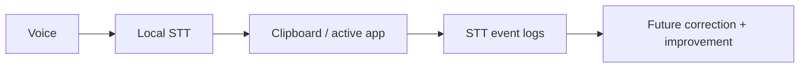

# DicTeX

DicTeX is a local-first voice tool for mathematical dictation.

It currently turns spoken language into text that can be inserted into the active application, while storing local STT data that can later support correction, evaluation, and fine-tuning.

## Core Idea

Mathematical dictation is not only speech-to-text.

Users mix natural language, equations, commands, hesitation, and corrections. DicTeX is designed around that reality, but the current implementation intentionally starts with the dictation foundation:

```text
Voice
-> transcription
-> clipboard / active app insertion
-> local STT event logging
```

Future math loop:

```text
Voice
-> transcription
-> paragraph/math detection
-> text + LaTeX generation
-> insertion into the active app
-> fast correction
-> correction logs
-> future improvement
```

## Product Loop



## MVP Scope

The current MVP focuses on a small but useful local workflow:

- local speech-to-text;
- insertion into the active application;
- global hotkey dictation;
- Windows auto-paste;
- local audio segment storage;
- local STT result logging.

Future MVP layers include:

- paragraph vs math detection;
- spoken math to LaTeX;
- fast correction loop;
- correction event logging;
- optional Markdown + LaTeX output.

## Not In The MVP

- cloud sync;
- collaborative editing;
- full computer algebra system;
- production-grade fine-tuning;
- mobile apps;
- multi-user backend.

## Why Local Logs Matter

Every segment should preserve the audio -> STT output link. Future corrections should be stored with context:

```json
{
  "session_id": "session_2026_07_05_001",
  "segment_id": "seg_042",
  "target_app": "obsidian",
  "raw_transcript": "un sur x plus un",
  "predicted_latex": "\\frac{1}{x} + 1",
  "corrected_latex": "\\frac{1}{x + 1}",
  "error_type": "fraction_scope",
  "correction_method": "voice"
}
```

Those logs can later improve:

- parsing rules;
- prompts;
- user preferences;
- evaluation datasets;
- fine-tuned models.

## Francais

DicTeX est un outil local-first de dictee mathematique.

Il transforme la voix en texte et equations LaTeX inserables dans l'application active, tout en enregistrant un journal de corrections utilisable pour ameliorer progressivement le systeme.

Objectif produit :

```text
Dicter des maths, corriger vite, ameliorer le systeme avec chaque correction.
```

## Documentation

- [Vision](docs/vision.md)
- [MVP](docs/mvp.md)
- [Architecture](docs/architecture.md)
- [Correction Loop](docs/correction-loop.md)
- [Open Source Landscape](docs/open-source-landscape.md)
- [Development](docs/development.md)
- [Product Decisions](docs/product-decisions.md)

## Status

Early MVP. The app currently supports local faster-whisper transcription, local STT event logging, global Windows hotkey dictation, and Windows auto-paste.
