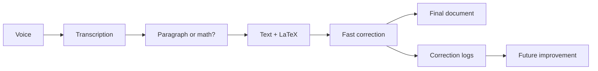

# DicTeX

DicTeX is a local-first voice tool for mathematical writing.

It turns spoken language into structured documents containing paragraphs, LaTeX equations, and correction logs that can later improve the system.

## Core Idea

Mathematical dictation is not only speech-to-text.

Users mix natural language, equations, commands, hesitation, and corrections. DicTeX is designed around that reality:

```text
Voice
-> transcription
-> paragraph/math detection
-> text + LaTeX generation
-> fast correction
-> correction logs
-> future improvement
```

## Product Loop



## MVP Scope

The first version focuses on a small but useful local workflow:

- local speech-to-text;
- paragraph vs math detection;
- spoken math to LaTeX;
- editable rendered document;
- fast correction loop;
- local correction logging;
- Markdown + LaTeX export.

## Not In The MVP

- cloud sync;
- collaborative editing;
- full computer algebra system;
- production-grade fine-tuning;
- mobile apps;
- multi-user backend.

## Why Correction Logs Matter

Every correction should be stored with context:

```json
{
  "audio_segment_id": "seg_042",
  "raw_transcript": "un sur x plus un",
  "predicted_latex": "\\frac{1}{x} + 1",
  "corrected_latex": "\\frac{1}{x + 1}",
  "error_type": "fraction_scope",
  "correction_method": "voice"
}
```

Those logs can later improve:

- parsing rules;
- prompts;
- user preferences;
- evaluation datasets;
- fine-tuned models.

## Francais

DicTeX est un outil local-first de dictee mathematique.

Il transforme la voix en documents structures contenant du texte, des equations LaTeX et un journal de corrections utilisable pour ameliorer progressivement le systeme.

Objectif produit :

```text
Dicter des maths, corriger vite, ameliorer le systeme avec chaque correction.
```

## Documentation

- [Vision](docs/vision.md)
- [MVP](docs/mvp.md)
- [Architecture](docs/architecture.md)
- [Correction Loop](docs/correction-loop.md)
- [Open Source Landscape](docs/open-source-landscape.md)

## Status

Early product definition. No usable implementation yet.

