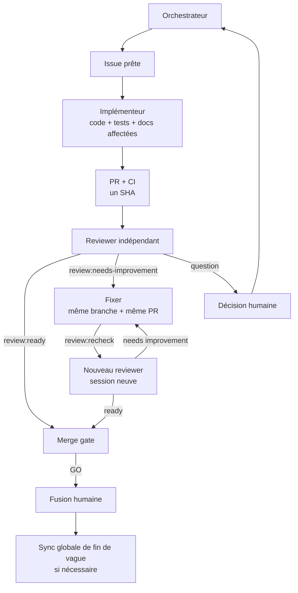

# Workflow agentique de DicTeX

Statut : protocole canonique de développement depuis le 11 juillet 2026.

Ce document définit les rôles, les points d'arrêt, le routage des modèles et
les transitions GitHub. `AGENTS.md` conserve les invariants du dépôt ; les
skills exécutables se trouvent dans `.agents/skills/` pour Codex et dans
`.claude/skills/` pour Claude Code.

## Principe central

```text
une session = un rôle = un point d'arrêt
une issue = un clone = une branche = une PR
un verdict = un SHA précis
```

L'implémenteur ne se revoit pas. Le Fixer corrige dans la branche et la PR
existantes. Une nouvelle session indépendante revoit ensuite le nouveau SHA.
La fusion finale reste humaine.

## Démarrage minimal

Lancer Codex ou Claude Code depuis la racine d'un checkout DicTeX afin que les
skills du dépôt soient découverts. Après fusion de ce protocole :

```powershell
cd C:\Users\souid\DicTeX
git pull --ff-only origin main
```

Une invocation ne fournit que la cible et les contraintes exceptionnelles :

| Action | Codex | Claude Code | Point d'arrêt implicite |
| --- | --- | --- | --- |
| Orchestrer | `$dictex-orchestrate prochaine vague` | `/dictex-orchestrate prochaine vague` | plan et tickets, aucun code |
| Implémenter | `$dictex-implement 114` | `/dictex-implement 114` | PR ouverte et vérifiée |
| Revoir | `$dictex-review 117` | `/dictex-review 117` | verdict commenté et étiqueté |
| Corriger la revue | `$dictex-fix-review 117` | `/dictex-fix-review 117` | corrections poussées dans la même PR |
| Revoir à nouveau | `$dictex-rereview 117` | `/dictex-rereview 117` | nouveau verdict sur le nouveau SHA |
| Contrôler avant fusion | `$dictex-merge-gate 117` | `/dictex-merge-gate 117` | rapport GO ou NO-GO, aucune fusion |
| Synchroniser les documents globaux | `$dictex-sync-docs 113,114,115` | `/dictex-sync-docs 113,114,115` | PR documentaire ouverte |

Le skill découvre lui-même l'état vivant : issue, dépendances, `origin/main`,
branche distante, PR, SHA et CI. Il connaît aussi son point d'arrêt. Il ne pose
une question que si la cible manque, si une décision produit est nécessaire ou
si l'état réel rend l'action ambiguë.

## Routage des modèles

Les identifiants ci-dessous sont figés pour rendre les handoffs reproductibles.
Le niveau du ticket exprime d'abord le risque ; le fournisseur vient ensuite.

| Niveau | Codex | Claude Code | Usage |
| --- | --- | --- | --- |
| `level:faible` | GPT-5.6-Luna, `gpt-5.6-luna`, low ou medium | Claude Haiku 4.5, `claude-haiku-4-5-20251001` | opération mécanique, vérification factuelle |
| `level:moyen` | GPT-5.6-Terra, `gpt-5.6-terra`, medium | Claude Sonnet 5, `claude-sonnet-5`, medium | implémentation quotidienne bien spécifiée |
| `level:eleve` | GPT-5.6-Terra high si la spécification est fermée, sinon GPT-5.6-Sol `gpt-5.6-sol` high | Claude Opus 4.8, `claude-opus-4-8`, high | données, concurrence, architecture, risque de régression |
| `level:tres-eleve` | GPT-5.6-Sol, `gpt-5.6-sol`, xhigh ou max | Claude Fable 5, `claude-fable-5`, max ; repli Opus 4.8 max | sémantique centrale, investigation longue, coût d'erreur maximal |

Routage de la revue :

| Revue | Codex | Claude Code |
| --- | --- | --- |
| normale, niveaux faible ou moyen | GPT-5.6-Terra high | Claude Sonnet 5 high |
| `needs:high-review` ou niveau élevé | GPT-5.6-Sol xhigh | Claude Opus 4.8 xhigh |
| niveau très élevé exceptionnel | GPT-5.6-Sol max | Claude Fable 5 max ; repli Opus 4.8 max |

Exemples de lancement :

```powershell
# Codex, implémentation quotidienne
codex --model gpt-5.6-terra -c model_reasoning_effort=medium

# Codex, revue renforcée
codex --model gpt-5.6-sol -c model_reasoning_effort=xhigh

# Claude Code, implémentation quotidienne
claude --model claude-sonnet-5 --effort medium

# Claude Code, revue renforcée
claude --model claude-opus-4-8 --effort xhigh
```

Les skills ne changent pas silencieusement le modèle. Après lecture du niveau,
un agent sous-dimensionné s'arrête avant toute écriture et donne la commande de
relance exacte. Chaque sortie de rôle donne également le modèle et l'invocation
de la session suivante. Les façades Claude héritent volontairement du modèle
actif : épingler Sonnet dans le skill d'implémentation empêcherait de relancer
ce même rôle sur Opus pour un ticket élevé.

Références fournisseurs :

- [skills Codex](https://developers.openai.com/codex/skills) ;
- [modèles Claude](https://platform.claude.com/docs/en/about-claude/models/overview) ;
- [configuration des modèles Claude Code](https://code.claude.com/docs/en/model-config) ;
- [skills Claude Code](https://code.claude.com/docs/en/slash-commands).

## États de revue

Trois labels exclusifs décrivent l'état courant de la PR :

- `review:ready` : le SHA examiné est accepté ;
- `review:needs-improvement` : un plan B1/B2 doit être corrigé ;
- `review:recheck` : le Fixer a poussé ses corrections et demande une nouvelle
  revue.

Le label `question` signale une décision produit manquante. Le label
`needs:high-review` décrit le niveau de contradiction requis ; il ne remplace
pas un état de revue.

Un verdict READY devient caduc dès que le HEAD change. Une mise à jour de la
branche de base est elle aussi un nouveau commit et impose une nouvelle revue.

## Documentation dans la boucle

La documentation directement affectée voyage avec le changement :

1. l'implémenteur la met à jour dans sa PR, ou écrit
   `Documentation non requise : <raison>` ;
2. le reviewer vérifie cette mise à jour ou sa justification ;
3. si le Fixer modifie le comportement, le contrat ou la roadmap, il corrige
   les mêmes documents dans la même PR ;
4. la nouvelle revue contrôle aussi ce diff documentaire.

`dictex-sync-docs` ne remplace pas cette obligation. Il sert uniquement, après
plusieurs fusions, à réaligner les documents globaux et les états devenus faux
dans une PR documentaire distincte.

## Vue d'ensemble



## Garde-fous actuels

- `main` n'est pas protégée et l'auto-merge est désactivé ;
- aucun agent ne fusionne pour l'instant ;
- le merge gate est une vérification en lecture seule ;
- tout travail d'implémentation part d'un clone frais ;
- GitHub en direct et `origin/main` priment sur les photographies locales ;
- les tickets, commits, PR, revues et documents sont en français ; le code,
  les tests, les journaux et l'interface restent en anglais.
