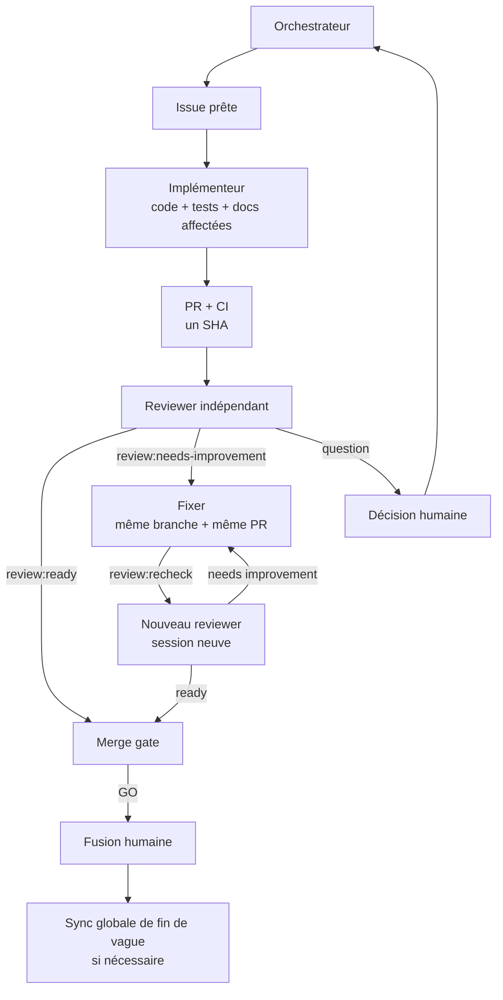

# Workflow agentique de DicTeX

Statut : protocole canonique de développement depuis le 11 juillet 2026.

Ce document définit les rôles, les points d'arrêt, le routage des modèles et
les transitions GitHub. `AGENTS.md` conserve les invariants du dépôt ; les
skills exécutables se trouvent dans `.agents/skills/` pour Codex et dans
`.claude/skills/` pour Claude Code.

## Principe central

```text
une session = un rôle = un point d'arrêt
une issue = un clone = une branche = une PR
un verdict = un SHA précis
```

L'implémenteur ne se revoit pas. Le Fixer corrige dans la branche et la PR
existantes. Une nouvelle session indépendante revoit ensuite le nouveau SHA.
La fusion finale reste humaine.

## Commits dans une PR

Le grain d'un commit n'est pas le grain de `main` : l'historique d'une PR est
aplati à la fusion (squash), donc `main` conserve une ligne par issue. À
l'intérieur d'une PR, un agent **committe par étape**, jamais en un seul bloc
final.

Une étape mérite son propre commit si elle est :

1. **verte** — `npm run typecheck` et `npm run test` passent sur ce commit ;
2. **autonome** — un seul changement cohérent, jamais un demi-move ;
3. **nommée** clairement en français, comme un message de `main`.

Ce sont des points de contrôle verts, pas des sauvegardes au fil de l'eau.
L'historique d'une PR reste ainsi bisectable sans polluer `main`.

Conséquences pour les rôles :

- un refactor mécanique se découpe en **un commit par unité déplacée** (une
  vue, un module, un helper), ce qui rend la revue vérifiable move par move ;
- le Fixer committe ses corrections **au-dessus** de l'implémentation, sans
  réécrire l'historique de la PR : le reviewer neuf lit ainsi le delta du Fixer
  isolément ;
- le verdict porte toujours sur le HEAD (`un verdict = un SHA précis`) ;
  multiplier les commits ne multiplie pas les revues.

Si `main` passait un jour au rebase-merge, chaque commit deviendrait public : la
même barre verte resterait obligatoire, commit par commit.

## Démarrage minimal

Lancer Codex ou Claude Code depuis la racine d'un checkout DicTeX afin que les
skills du dépôt soient découverts. Après fusion de ce protocole :

```powershell
cd C:\Users\souid\DicTeX
git pull --ff-only origin main
```

Une invocation ne fournit que la cible et les contraintes exceptionnelles :

| Action | Codex | Claude Code | Point d'arrêt implicite |
| --- | --- | --- | --- |
| Orchestrer | `$dictex-orchestrate prochaine vague` | `/dictex-orchestrate prochaine vague` | plan et tickets, aucun code |
| Implémenter | `$dictex-implement 114` | `/dictex-implement 114` | PR ouverte et vérifiée |
| Revoir | `$dictex-review 117` | `/dictex-review 117` | verdict commenté et étiqueté |
| Corriger la revue | `$dictex-fix-review 117` | `/dictex-fix-review 117` | corrections poussées dans la même PR |
| Revoir à nouveau | `$dictex-rereview 117` | `/dictex-rereview 117` | nouveau verdict sur le nouveau SHA |
| Contrôler avant fusion | `$dictex-merge-gate 117` | `/dictex-merge-gate 117` | rapport GO ou NO-GO, aucune fusion |
| Synchroniser les documents globaux | `$dictex-sync-docs 113,114,115` | `/dictex-sync-docs 113,114,115` | PR documentaire ouverte |

Le skill découvre lui-même l'état vivant : issue, dépendances, `origin/main`,
branche distante, PR, SHA et CI. Il connaît aussi son point d'arrêt. Il ne pose
une question que si la cible manque, si une décision produit est nécessaire ou
si l'état réel rend l'action ambiguë.

## Niveaux de raisonnement des agents

Quatre labels sans accents décrivent le risque d'un ticket : `level:faible`,
`level:moyen`, `level:eleve`, `level:tres-eleve`. Le label orthogonal
`needs:high-review` n'est pas un cinquième niveau : il exige que
l'implémenteur signale une revue renforcée et recommande le modèle adapté ;
une session distincte réalise cette revue avant la fusion.

- `level:faible` — effort faible, changement mécanique ou déjà balisé ;
- `level:moyen` — effort moyen, avec un peu de jugement de conception ou d'UI ;
- `level:eleve` — effort élevé, correction ou intégrité des données critique ;
- `level:tres-eleve` — effort maximal, sémantique centrale ou coût d'erreur
  important.

### Attribution d'un niveau

Noter le ticket de 1 à 4 sur cinq axes :

- **A. Complexité cognitive** : 1 = appliquer un motif connu ; 4 = concevoir
  ou évaluer des choix ouverts ;
- **B. Incertitude de la spécification** : 1 = fermée ; 4 = décision produit
  manquante ;
- **C. Rayon d'impact et réversibilité** : 1 = fichier isolé ; 4 = sémantique
  centrale, historique à ajout uniquement ou intégrité des données ;
- **D. Horizon** : 1 = une étape ; 4 = plusieurs modules et étapes ;
- **E. Coût d'une erreur** : 1 = cosmétique ; 4 = corruption de données ou
  invalidation d'une évaluation.

Si **C** ou **E** vaut 4, le niveau est au moins `level:eleve`. Sinon, utiliser
la moyenne arrondie. Un axe critique domine volontairement la moyenne.

## Routage des modèles

Les identifiants ci-dessous sont figés pour rendre les handoffs reproductibles.
Le niveau du ticket exprime d'abord le risque ; le fournisseur vient ensuite.

| Niveau | Codex | Claude Code | Usage |
| --- | --- | --- | --- |
| `level:faible` | GPT-5.6-Luna, `gpt-5.6-luna`, low ou medium | Claude Haiku 4.5, `claude-haiku-4-5-20251001` | opération mécanique, vérification factuelle |
| `level:moyen` | GPT-5.6-Terra, `gpt-5.6-terra`, medium | Claude Sonnet 5, `claude-sonnet-5`, medium | implémentation quotidienne bien spécifiée |
| `level:eleve` | GPT-5.6-Terra high si la spécification est fermée, sinon GPT-5.6-Sol `gpt-5.6-sol` high | Claude Opus 4.8, `claude-opus-4-8`, high | données, concurrence, architecture, risque de régression |
| `level:tres-eleve` | GPT-5.6-Sol, `gpt-5.6-sol`, xhigh ou max | Claude Fable 5, `claude-fable-5`, max ; repli Opus 4.8 max | sémantique centrale, investigation longue, coût d'erreur maximal |

Routage de la revue :

| Revue | Codex | Claude Code |
| --- | --- | --- |
| normale, niveaux faible ou moyen | GPT-5.6-Terra high | Claude Sonnet 5 high |
| `needs:high-review` ou niveau élevé | GPT-5.6-Sol xhigh | Claude Opus 4.8 xhigh |
| niveau très élevé exceptionnel | GPT-5.6-Sol max | Claude Fable 5 max ; repli Opus 4.8 max |

Exemples de lancement :

```powershell
# Codex, implémentation quotidienne
codex --model gpt-5.6-terra -c model_reasoning_effort=medium

# Codex, revue renforcée
codex --model gpt-5.6-sol -c model_reasoning_effort=xhigh

# Claude Code, implémentation quotidienne
claude --model claude-sonnet-5 --effort medium

# Claude Code, revue renforcée
claude --model claude-opus-4-8 --effort xhigh
```

Les skills ne changent pas silencieusement le modèle. Après lecture du niveau,
un agent sous-dimensionné s'arrête avant toute écriture et donne la commande de
relance exacte. Chaque sortie de rôle donne également le modèle et l'invocation
de la session suivante. Les façades Claude héritent volontairement du modèle
actif : épingler Sonnet dans le skill d'implémentation empêcherait de relancer
ce même rôle sur Opus pour un ticket élevé.

Un agent Codex reste dans la famille OpenAI ; un agent Claude reste dans la
famille Anthropic. Les slugs de niveau sans accents garantissent des commandes
et URL propres ; leur sens affiché reste faible, moyen, élevé et très élevé.

Références fournisseurs :

- [skills Codex](https://developers.openai.com/codex/skills) ;
- [modèles Claude](https://platform.claude.com/docs/en/about-claude/models/overview) ;
- [configuration des modèles Claude Code](https://code.claude.com/docs/en/model-config) ;
- [skills Claude Code](https://code.claude.com/docs/en/slash-commands).

## États de revue

Trois labels exclusifs décrivent l'état courant de la PR :

- `review:ready` : le SHA examiné est accepté ;
- `review:needs-improvement` : un plan B1/B2 doit être corrigé ;
- `review:recheck` : le Fixer a poussé ses corrections et demande une nouvelle
  revue.

Le label `question` signale une décision produit manquante. Le label
`needs:high-review` décrit le niveau de contradiction requis ; il ne remplace
pas un état de revue.

Un verdict READY devient caduc dès que le HEAD change. Une mise à jour de la
branche de base est elle aussi un nouveau commit et impose une nouvelle revue.

## Documentation dans la boucle

La documentation directement affectée voyage avec le changement :

1. l'implémenteur la met à jour dans sa PR, ou écrit
   `Documentation non requise : <raison>` ;
2. le reviewer vérifie cette mise à jour ou sa justification ;
3. si le Fixer modifie le comportement, le contrat ou la roadmap, il corrige
   les mêmes documents dans la même PR ;
4. la nouvelle revue contrôle aussi ce diff documentaire.

`dictex-sync-docs` ne remplace pas cette obligation. Il sert uniquement, après
plusieurs fusions, à réaligner les documents globaux et les états devenus faux
dans une PR documentaire distincte.

## Dépendances entre issues

Il n'existe pas de blocage natif GitHub. Les dépendances vivent en texte brut
dans le corps du ticket et sont contrôlées par la garde d'entrée de
l'implémenteur (étape 0) — ceci reste indépendant du fournisseur (Codex et
Claude lisent la même ligne) et ne nécessite aucun outillage supplémentaire.

### Ligne de dépendance (source de vérité)

Tout ticket qui dépend d'un autre porte une ligne unique, analysable par une
machine, dans son corps :

```text
Depends on: #38, #39
```

Règles :

- une seule ligne, numéros d'issues séparés par des virgules ; omettre la
  ligne s'il n'y a aucune dépendance dure ;
- une dépendance signifie « doit être CLOSED avant que ce ticket puisse
  commencer », rien de plus ;
- ceci remplace les sections prose `## Dependencies` ; garder du contexte
  prose si utile, mais la ligne `Depends on:` est ce que les agents analysent ;
- ne lister que les dépendances **dures** (ordre réel). Une relation souple
  « fonctionne mieux après » est une note, pas une entrée `Depends on:`.

### Responsabilités de l'orchestrateur

Lire d'abord l'état vivant des issues avec `gh` (ouvertes/fermées, labels,
lignes `Depends on:`) — une photographie locale de la feuille de route peut
avoir vieilli. Lorsqu'il planifie les N prochains tickets, l'orchestrateur :

1. rédige chaque ticket en français avec Objectif / Pourquoi / Périmètre /
   Hors périmètre / Critères d'acceptation ;
2. note chaque ticket avec la grille à cinq axes et applique le label
   `level:*` correct (plus `needs:high-review` si une revue renforcée est
   justifiée) ;
3. ajoute une ligne `Depends on:` listant uniquement les dépendances dures ;
4. propose un modèle par ticket depuis la table de routage (colonnes Claude et
   Codex), pour que n'importe quel fournisseur puisse le reprendre ;
5. produit un **plan de lancement par vagues** indiquant les tickets qui
   peuvent commencer et ceux qui doivent attendre :

```text
Vague 1 (prêts, en parallèle) : #42 (faible), #38 (élevé)
Vague 2 (après #38)           : #39 (très-élevé)
Vague 3 (après #39)           : #40 (moyen), #41 (moyen)
```

6. signale séparément les **conflits mous** : des issues sans dépendance dure
   qui touchent quand même les mêmes fichiers/module. Ce ne sont pas des
   entrées `Depends on:` ; c'est une note pour les séquencer, puisque des
   clones séparés entrent quand même en conflit de fusion sur des fichiers
   partagés.

### Comment une dépendance se lève

Aucun label de statut à maintenir. Quand une issue est fusionnée et son ticket
GitHub CLOSED, ses dépendants deviennent lançables automatiquement : la garde
d'entrée du prochain implémenteur voit la dépendance CLOSED et continue. Si
lancé trop tôt, la garde arrête l'agent avant toute écriture de code. La ligne
`Depends on:` est la seule chose à garder correcte.

## Vue d'ensemble



## Garde-fous actuels

- `main` n'est pas protégée et l'auto-merge est désactivé ;
- aucun agent ne fusionne pour l'instant ;
- le merge gate est une vérification en lecture seule ;
- tout travail d'implémentation part d'un clone frais ;
- GitHub en direct et `origin/main` priment sur les photographies locales ;
- les tickets, commits, PR, revues et documents sont en français ; le code,
  les tests, les journaux et l'interface restent en anglais.
