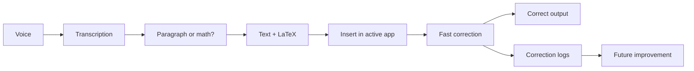

# Architecture

The first architecture should be simple and local.



## Pipeline

```text
Audio capture
-> speech-to-text
-> transcript normalization
-> paragraph/math/command classification
-> LaTeX generation
-> insertion into active app
-> correction
-> correction event storage
```

## Recommended MVP Stack

- Desktop shell: Tauri or a local web app.
- UI: React.
- Editor: TipTap or CodeMirror.
- STT: faster-whisper first, whisper.cpp later for packaging.
- Local LLM: Ollama first, llama.cpp later for tighter integration.
- Math rendering: KaTeX.
- Math validation: SymPy and latex2sympy2.
- Storage: SQLite.
- Training export: JSONL.

## Data Model

Core entities:

- dictation session;
- audio segment;
- raw transcript;
- normalized transcript;
- generated output;
- correction event;
- target application;
- user preference.

The data model must preserve the link between what was spoken, what the system generated, and what the user corrected.

For the MVP, DicTeX should not assume that it owns the document. It acts like a local dictation layer that outputs text and LaTeX into another application.
