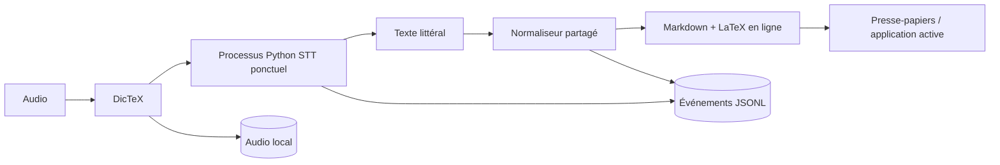
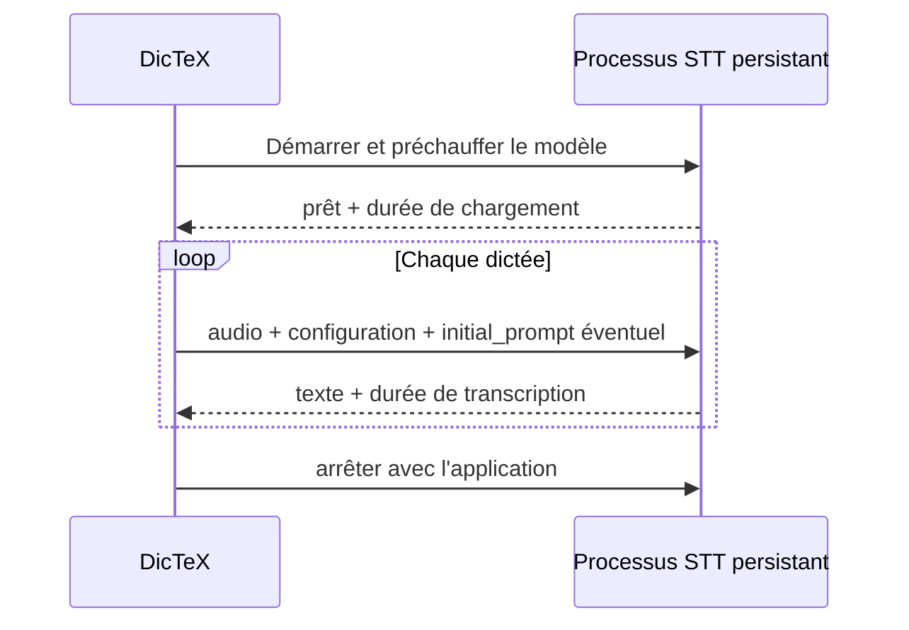

# Architecture

DicTeX est un monorepo local composé d'un outil quotidien, d'un laboratoire et
de deux paquets partagés.

```text
apps/dictex       microphone, raccourci, normalisation, insertion, historique
apps/lab          écoute, corrections, mesures, ensembles et exports
packages/engine   fournisseurs STT Python
packages/shared   événements, normaliseur, LaTeX, mesures et exports TypeScript
```

## Flux actuel de DicTeX



Le processus Python est encore lancé pour une transcription puis arrêté. La
prochaine architecture STT quotidienne remplace cette frontière ponctuelle par
un processus persistant qui garde un seul modèle actif en mémoire.

## Flux cible du moteur STT



Contraintes : un seul modèle chargé sur la carte graphique, redémarrage lors
d'un changement de modèle ou de configuration, reprise explicite après un
incident, et mesure séparée du chargement initial et des requêtes chaudes.

## Frontière DicTeX / Lab

DicTeX écrit ses données brutes dans son dossier local :

```text
audio_segment
stt_result
normalization_result
```

Le Lab lit ce dossier sans le modifier. Il écrit les corrections, appartenances
aux ensembles, résultats de comparaison, sélections et exports dans son propre
dossier. Les deux applications partagent les fonctions de dérivation afin
d'éviter une divergence entre ce qui est servi et ce qui est mesuré.

## Modèle de données

Le cœur reste centré sur :

```text
session_id + segment_id + audio_ref
```

Les événements sont à ajout uniquement (`append-only`). Une correction ou une
nouvelle sélection ajoute un événement ; elle ne réécrit pas le passé. DicTeX
ne possède pas le document Typora et n'introduit pas de `document_id` dans le
flux principal.

## Évolutions exclues pour l'instant

Pas d'éditeur interne, de base SQLite, d'analyseur mathématique complet, de
nuage, de registre de modèles ni de service multiutilisateur sans décision
explicite dans la feuille de route.
