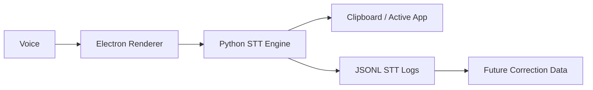

# Architecture

The first architecture is simple and local.



## Pipeline

Current pipeline:

```text
Audio capture
-> speech-to-text
-> clipboard
-> optional Windows auto-paste
-> audio_segment + stt_result event storage
```

Future math pipeline:

```text
STT output
-> transcript normalization
-> paragraph/math/command classification
-> LaTeX generation
-> correction
-> correction event storage
```

## Current MVP Stack

- Desktop shell: Electron.
- UI: React.
- App language: TypeScript.
- STT sidecar: Python.
- STT engine: faster-whisper.
- Storage: JSONL events plus local audio files.
- Training export: JSONL.

Possible later additions:

- whisper.cpp for packaging.
- Ollama or llama.cpp for local math/text transformation.
- KaTeX for math preview.
- SymPy and latex2sympy2 for math validation.
- SQLite when JSONL is no longer enough.

## Data Model

Core entities:

- dictation session;
- audio segment;
- raw transcript;
- STT result;
- correction event later;
- user preference later.

The current data model must preserve the link between what was spoken and what the STT model produced.

For the MVP, DicTeX should not assume that it owns the document. It acts like a local dictation layer that outputs text into another application. LaTeX generation is a future layer.
