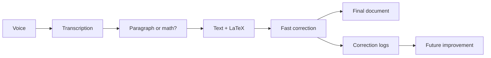

# Architecture

The first architecture should be simple and local.



## Pipeline

```text
Audio capture
-> speech-to-text
-> transcript normalization
-> paragraph/math/command classification
-> LaTeX generation
-> rendering
-> correction
-> correction event storage
```

## Recommended MVP Stack

- Desktop shell: Tauri or a local web app.
- UI: React.
- Editor: TipTap or CodeMirror.
- STT: faster-whisper first, whisper.cpp later for packaging.
- Local LLM: Ollama first, llama.cpp later for tighter integration.
- Math rendering: KaTeX.
- Math validation: SymPy and latex2sympy2.
- Storage: SQLite.
- Training export: JSONL.

## Data Model

Core entities:

- document;
- audio segment;
- raw transcript;
- normalized transcript;
- generated block;
- correction event;
- user preference.

The data model must preserve the link between what was spoken, what the system generated, and what the user corrected.

