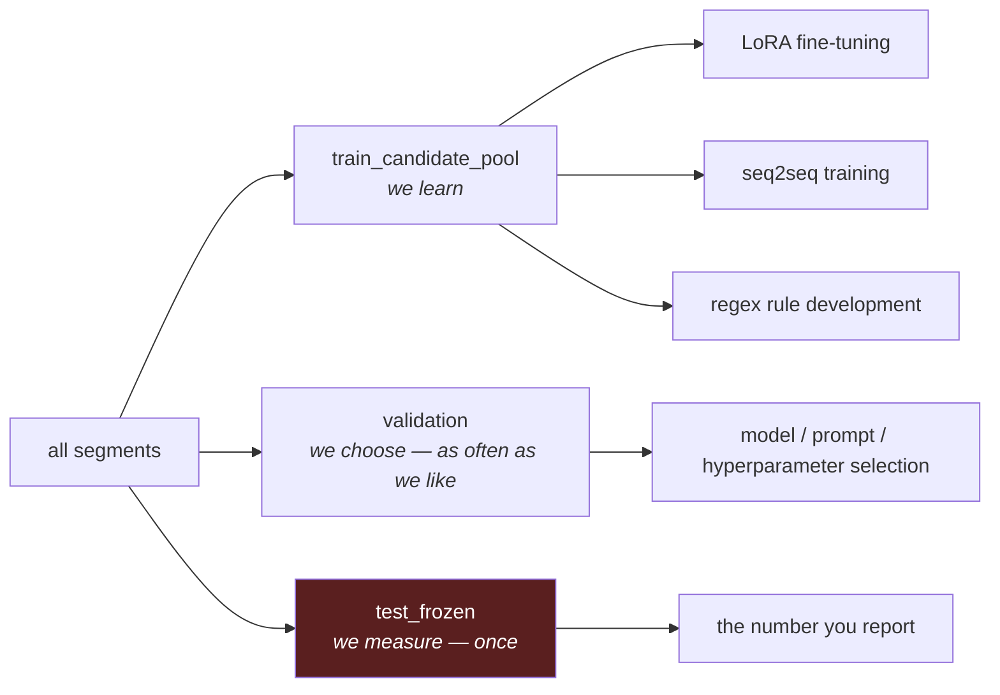
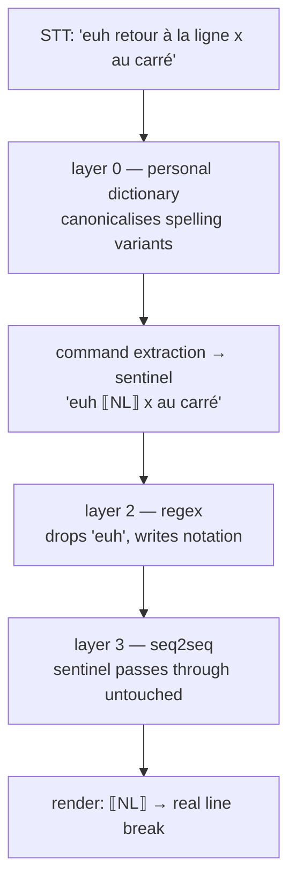

# Dataset & Normalization Design

How DicTeX Lab's data is structured, why it is split the way it is, and how the
normalizer pipeline consumes it. This document settles the questions that were
left implicit after the DicTeX/Lab split (`pivot_dictex_lab_split.md`) and the
normalization strategy (`pivot_strategique_stt_normalisation.md`).

Read this before adding a correction kind, a normalizer layer, or a dataset
export field.

---

## 1. One segment, two datasets

A *segment* is one recorded dictation. From it we derive two independent
training datasets, and the whole design exists to keep them separable.


**Layer 1 is verbatim.** It transcribes what left the speaker's mouth —
including `euh`, false starts, and repetitions. The acoustic model's job is to
transcribe, not to clean. Training it on a cleaned target teaches it to delete
words it heard, and it will generalise that deletion to real words.

**Layer 2 is the clean, formal notation.** The `math_transform` pair therefore
learns two things at once: remove disfluencies, and write notation. Both are the
same underlying task ("spoken → written"), so they are not separated. The
separability that matters — acoustic vs. text-transform — is preserved.

Disfluency removal itself does not need a learned model: a handful of regex
rules in normalizer layer 2 (`\b(euh|hum|ben)\b`) handle it deterministically.
Do not spend the seq2seq's capacity on it.

### Why a paste source can never produce an acoustic pair

An acoustic pair is `audio → verbatim`. The clipboard carries text only — no
`segment_id`, no `audio_ref`. A pasted entry has no audio to pair with, so
`planDatasetBuilderSave` restricts it to `math_transform`
(`apps/lab/src/main/datasetBuilder.ts`). This is not a UI limitation to work
around; it is what keeps audio-less records out of the STT training set.

Consequence: **paste mode is the cheap path to volume** for the normalizer
dataset (the one that needs it), and **segment mode is the only path** to
acoustic data.

---

## 2. Corrections are bound to segments, never to models

`stt_correction` carries `session_id`, `segment_id`, `audio_ref`,
`raw_transcript`, `corrected_transcript`, `correction_method`,
`correction_kind`. There is **no model field**, and this is deliberate.

A correction records *what should have been said for this audio* — ground truth,
independent of whichever model produced the draft. That is what makes the
benchmark possible: any candidate (tiny, large-v3-turbo, Vosk, a new system
prompt) can be replayed against the same segment and scored against the same
reference. If corrections were bound to a model, every model change would
invalidate the corpus.

The **exported record** (`SttDatasetRecord`, `packages/shared/src/datasetExport.ts`)
does carry `sttEngine` / `sttModel` / `originalSttOutput`. These are joined in
from the `stt_result` event as **provenance**, so a bad model can be audited
after the fact. They are never a training input: the acoustic pair's input is
the audio itself.

---

## 3. Splits: one pile of segments, cut in three

`stt_benchmark_set_membership` assigns each segment to exactly one split. Splits
are **disjoint partitions of segments**, not copies of a dataset.



**Why split at all.** A model trained on a pair and then tested on that same
pair reports its memory, not its ability to generalise. The number is
meaningless.

**Why three and not two.** Every time you look at `validation` to make a choice,
you leak a little information into that choice. After thirty comparisons, the
winner is partly the candidate that got lucky on those particular segments, and
the validation score is systematically optimistic. `test_frozen` is the pile you
never looked at, so luck never had a chance to accumulate there.

**Rules that make the numbers mean something:**

- Splits are drawn from the **same distribution** (same voice, mic, subject
  matter). Disjoint, not different. A deliberately dissimilar test set measures
  distribution shift, not generalisation.
- No near-duplicates across splits. In particular, **assign a split per
  recording take**, not per segment: two segments cut from one continuous take
  share phrasing and acoustics, so putting one in train and one in test is a
  leak.
- Synthetic data (LLM-generated pairs) belongs in `train_candidate_pool` only.
  An LLM-authored evaluation set measures agreement with the LLM, not with
  reality.
- When `validation` wears out, **collect more validation data**. Do not fall
  back on `test_frozen` — there is no fourth pile.
- `test_frozen` is read once, after every decision is made. The moment you
  iterate on it, it is a second validation set and you have no measurement left.

Starting proportions: roughly 70 / 15 / 15. Below a few hundred segments, weight
the two evaluation piles more heavily — a ten-segment `test_frozen` measures
nothing.

### The split is carried by the segment

A dataset is a computed view: *take every segment whose split is X, extract the
pairs you need.* Segment `seg_0042`, tagged `validation`, yields its acoustic
pair to the STT evaluation and its `math_transform` pair to the normalizer
evaluation. Both inherit the same label.

This is a guarantee, not an implementation detail. If splits were assigned per
dataset, a segment could be `train` for the acoustic model and `test_frozen` for
the normalizer — and since the STT feeds the normalizer, that contamination
would silently corrupt the end-to-end measurement. Binding the split to the
segment makes the leak impossible by construction.

---

## 4. Command words and sentinels

Some dictated phrases are **actions**, not text: "retour à la ligne" must insert
a line break. They must never reach the seq2seq, which would paraphrase them
away or hallucinate them.

**Detect early, execute late.** The literal phrase exists only in the raw STT
output. Extract it there, replace it with an inert *sentinel* that survives every
downstream layer untouched, and re-expand it into an action at render time.



The personal dictionary sits **before** extraction: it collapses "retour à la
line", "retourne à la ligne" and friends into one canonical form, so the
extractor has a single pattern to match.

### Sentinel format

One Unicode Private Use Area code point per command, `U+E000`–`U+E00F`:

| Code point | Command             | Debug rendering |
| ---------- | ------------------- | --------------- |
| `U+E000`   | retour à la ligne   | `NL`          |
| `U+E001`   | nouveau paragraphe  | `PARA`        |

Chosen because:

- **No STT can emit them.** The PUA appears in no text corpus, so no false
  positives.
- **No mathematical notation uses them.** By contrast `<<NL>>` contains `<` and
  `>`, which occur constantly in maths; ` ` are real mathematical brackets.
- **No regex can damage them.** One class, `[\uE000-\uE00F]`, matches them all,
  and no rule written for maths will ever touch them.
- **The seq2seq can hold them as special tokens** (`add_special_tokens`), so
  they stay atomic: the model cannot split, invent, or drop them.

Their one weakness — they are invisible, so a corrupted store would look healthy
— is neutralised by the storage rule below.

### Storage rule: never store a sentinel

**Write the words, never the effect.** In the dataset builder, a command is
typed in full, in canonical form, in *both* layers:

| | content |
| --- | --- |
| Layer 1 | `euh retour à la ligne x au carré plus deux` |
| Layer 2 | `retour à la ligne x² + 2` |

Substitution to sentinels is a **pure function applied at export**, using the
command list of the day:

```text
NL x au carré plus deux   →   NL x² + 2
```

Two consequences, both of which buy freedom:

1. Adding a command later (e.g. "ouvre la parenthèse") only changes a config
   file. Regenerate the export and every historical pair becomes correct
   retroactively. **The command list is never a decision you have to get right
   up front.**
2. Typing a literal line break into Layer 2 would destroy the information that a
   command was spoken, and nothing could be re-derived. This is the one thing
   that is irreversible.

The acoustic dataset is unaffected in all cases: Layer 1 is verbatim forever.

### Choosing command phrases

Prefer locutions nobody utters by accident ("retour à la ligne", "nouveau
paragraphe") over bare words. Do **not** make "point" or "virgule" commands —
maths says "le point A", "le point d'intersection". A literal escape ("littéral :
retour à la ligne") handles the residual ambiguity; do not build it before
meeting the case.

---

## 5. Producing the data

### Segment length

At equal total duration and equal subject matter, two one-minute segments and
one two-minute segment carry roughly the same acoustic value — Whisper windows
audio at 30 s regardless. Shorter segments still win, for reasons unrelated to
the model:

- a transcription error spoils one minute of data instead of two;
- reviewing a short segment is far faster, and this is done hundreds of times;
- the split is carried by the segment, so shorter segments give finer control
  (subject to the per-take rule in §3).

For the normalizer the difference is not neutral: a small seq2seq learns much
better from one-sentence pairs than from paragraphs. **Target 10–30 s.**

Lexical and notational diversity is the real currency, not duration. One minute
of integrals plus one minute of functions beats two minutes of functions.

### Reading LLM-generated topics

Having an LLM generate *subjects to read aloud* (exercises, proofs, patterns of
reasoning) is legitimate and useful: the audio is real, and it forces coverage
of constructs the author would not have thought to utter. It is not synthetic
evaluation data.

Two cautions:

- **Layer 1 must match what was said, not the script.** Paste the script as a
  starting point, replay the segment, and fix it against the actual utterance.
  Otherwise the acoustic target does not correspond to its audio, which is
  exactly the noise that makes a fine-tune useless.
- **Read speech is not spontaneous speech.** It has steadier rhythm and no
  hesitation. Read-aloud material is ideal for `train_candidate_pool`;
  `validation` and `test_frozen` must be dominated by real, spontaneous
  dictation, because an exam should resemble life.

Correspondingly, do not over-police yourself while reading. A training set with
no disfluencies teaches nothing about removing them.

| Split | Source | Layer 1 | Layer 2 |
| --- | --- | --- | --- |
| `train_candidate_pool` | reading LLM-generated topics | script fixed against audio | LLM notation, unreviewed |
| `validation` / `test_frozen` | mostly spontaneous dictation | script fixed against audio | LLM notation, **reviewed by a human** |

Pure `math_transform` pairs (text → text, no audio) can be mass-produced in
paste mode straight into `train_candidate_pool`, without ever opening the
microphone.

---

## 6. What this implies for the roadmap

The two datasets are not equally expensive, nor equally valuable:

| | Acoustic | math_transform |
| --- | --- | --- |
| Cost of one sample | dictate, then transcribe by hand | type two lines |
| Needs a segment / audio | yes | no |
| Reachable volume | low | high |
| Expected gain | a few % CER | the core of the product |

The cheapest lever on STT quality is not fine-tuning at all: it is the **system
prompt** (faster-whisper's `initial_prompt`). It costs no training data and no
GPU, and it is already representable in the existing candidate identity —
`{stage, provider, model, variant}` — as a new `variant`, with no schema change.
Benchmark prompt variants on `validation` before committing to acoustic
fine-tuning (#45); the prompt may already deliver what the fine-tune promises.

Suggested order:

1. Freeze a small but honest `test_frozen` **before** training anything.
2. Establish the regex normalizer's baseline on `validation`.
3. Benchmark STT system-prompt variants on `validation` — cheapest lever.
4. Mass-produce `math_transform` pairs in paste mode; train the seq2seq; compare
   it to the regex baseline on `validation`.
5. Acoustic fine-tuning last, and only if the STT benchmark shows a residue of
   genuinely acoustic errors that neither the prompt nor the normalizer fixes.
