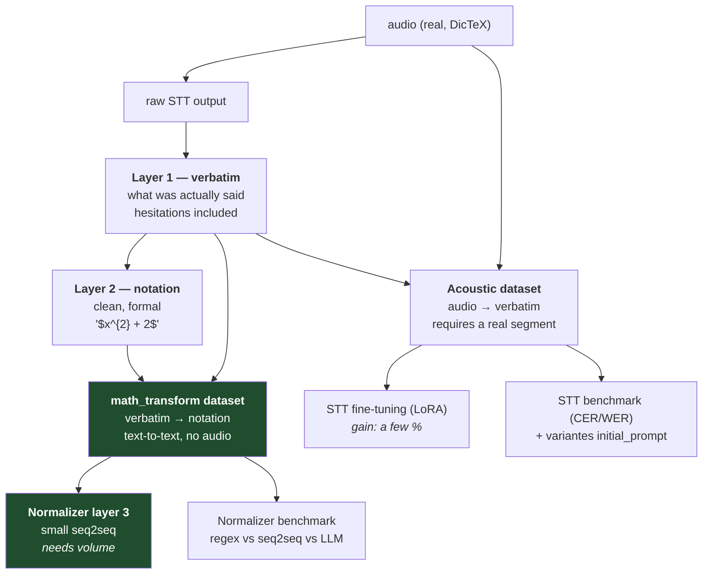
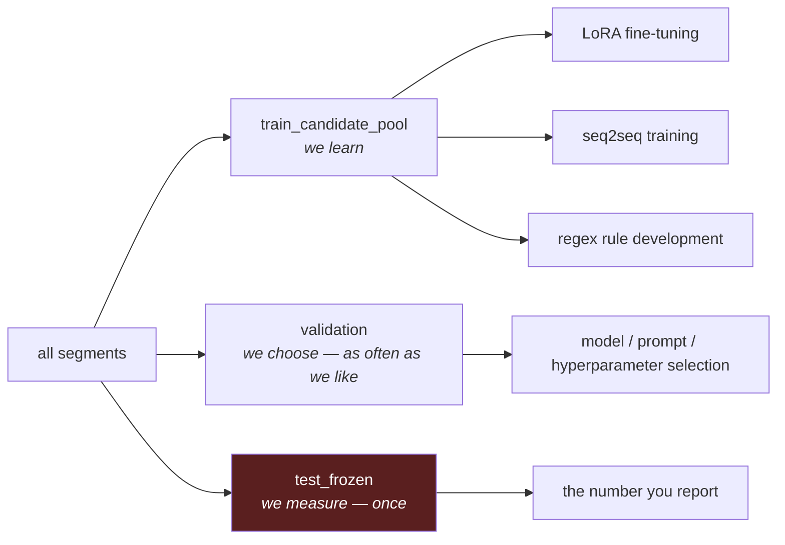
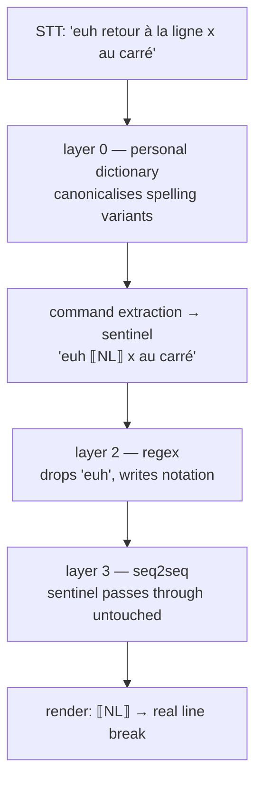

# Dataset & Normalization Design

> Ce document fixe les invariants de données. La priorité courante et les portes
> de sortie vivent dans `docs/roadmap.md`. Les sections historiques anglaises
> sont conservées ; toute nouvelle décision est rédigée en français.

How DicTeX Lab's data is structured, why it is split the way it is, and how the
normalizer pipeline consumes it. This document settles the questions that were
left implicit after the DicTeX/Lab split (`pivot_dictex_lab_split.md`) and the
normalization strategy (`pivot_strategique_stt_normalisation.md`).

Read this before adding a correction kind, a normalizer layer, or a dataset
export field.

**Provenance lorsque le normaliseur est désactivé (#105).** DicTeX conserve un
événement `normalization_result` même si le pipeline ne s'exécute pas. Cet
événement porte `disabled: true`, omet `passthrough`, répète le STT brut comme
entrée et sortie, et contient des `layers` et `diagnostics` vides. Ainsi,
`passthrough: true` continue de signifier exclusivement « pipeline exécuté sans
modification » et les données futures peuvent distinguer les deux situations.

---

## 1. One segment, two datasets

A *segment* is one recorded dictation. From it we derive two independent
training datasets, and the whole design exists to keep them separable.



**Layer 1 is verbatim.** It transcribes what left the speaker's mouth —
including `euh`, false starts, and repetitions. The acoustic model's job is to
transcribe, not to clean. Training it on a cleaned target teaches it to delete
words it heard, and it will generalise that deletion to real words.

### Convention lexicale de la couche 1

Depuis `DEC-COUCHE1-001` (13 juillet 2026), « littérale » signifie aussi que la
référence acoustique conserve la **verbalisation** prononcée au lieu d'accepter
une notation compacte produite par le décodeur : `theta`, pas `θ` ; `trois`, pas
`3` ; `x au carré`, pas `x²` ou `x^2` ; `sinus`, pas `sin`. La couche 2 porte la
transformation vers les symboles et le LaTeX.

La couche 1 reste une transcription orthographique française, pas une écriture
phonétique. Les choix encore ambigus — orthographe des nombres composés,
ponctuation éditoriale, hésitations et autocorrections — restent identifiés dans
`docs/questions-de-conventions.md`. Une sortie STT compacte est corrigée contre
l'audio dans le Lab ; elle n'est pas rendue vraie par un post-traitement qui ne
peut plus reconstruire les mots prononcés, en particulier pour un nombre ou un
décimal.

**Layer 2 is the clean, formal notation.** The `math_transform` pair therefore
learns two things at once: remove disfluencies, and write notation. Both are the
same underlying task ("spoken → written"), so they are not separated. The
separability that matters — acoustic vs. text-transform — is preserved.

Disfluency removal itself does not need a learned model: a handful of regex
rules in normalizer layer 2 (`\b(euh|hum|ben)\b`) handle it deterministically.
Do not spend the seq2seq's capacity on it.

### Why a paste source can never produce an acoustic pair

An acoustic pair is `audio → verbatim`. The clipboard carries text only — no
`segment_id`, no `audio_ref`. A pasted entry has no audio to pair with, so
`planDatasetBuilderSave` restricts it to `math_transform`
(`apps/lab/src/main/datasetBuilder.ts`). This is not a UI limitation to work
around; it is what keeps audio-less records out of the STT training set.

Consequence: **paste mode is the cheap path to volume** for the normalizer
dataset (the one that needs it), and **segment mode is the only path** to
acoustic data.

---

## 2. Corrections are bound to segments, never to models

`stt_correction` carries `session_id`, `segment_id`, `audio_ref`,
`raw_transcript`, `corrected_transcript`, `correction_method`,
`correction_kind`. There is **no model field**, and this is deliberate.

A correction records *what should have been said for this audio* — ground truth,
independent of whichever model produced the draft. That is what makes the
benchmark possible: any candidate (tiny, large-v3-turbo, Vosk, a new system
prompt) can be replayed against the same segment and scored against the same
reference. If corrections were bound to a model, every model change would
invalidate the corpus.

The **exported record** (`SttDatasetRecord`, `packages/shared/src/datasetExport.ts`)
does carry `sttEngine` / `sttModel` / `originalSttOutput`. These are joined in
from the `stt_result` event as **provenance**, so a bad model can be audited
after the fact. They are never a training input: the acoustic pair's input is
the audio itself.

---

## 3. Splits: one pile of segments, cut in three

`stt_benchmark_set_membership` assigns each segment to exactly one split. Splits
are **disjoint partitions of segments**, not copies of a dataset.



**Why split at all.** A model trained on a pair and then tested on that same
pair reports its memory, not its ability to generalise. The number is
meaningless.

**Why three and not two.** Every time you look at `validation` to make a choice,
you leak a little information into that choice. After thirty comparisons, the
winner is partly the candidate that got lucky on those particular segments, and
the validation score is systematically optimistic. `test_frozen` is the pile you
never looked at, so luck never had a chance to accumulate there.

**Rules that make the numbers mean something:**

- Splits are drawn from the **same distribution** (same voice, mic, subject
  matter). Disjoint, not different. A deliberately dissimilar test set measures
  distribution shift, not generalisation.
- No near-duplicates across splits. In particular, **assign a split per
  recording take**, not per segment: two segments cut from one continuous take
  share phrasing and acoustics, so putting one in train and one in test is a
  leak.
- Synthetic data (LLM-generated pairs) belongs in `train_candidate_pool` only.
  An LLM-authored evaluation set measures agreement with the LLM, not with
  reality.
- When `validation` wears out, **collect more validation data**. Do not fall
  back on `test_frozen` — there is no fourth pile.
- `test_frozen` is read once, after every decision is made. The moment you
  iterate on it, it is a second validation set and you have no measurement left.

Starting proportions: roughly 70 / 15 / 15. Below a few hundred segments, weight
the two evaluation piles more heavily — a ten-segment `test_frozen` measures
nothing.

### The split is carried by the segment

A dataset is a computed view: *take every segment whose split is X, extract the
pairs you need.* Segment `seg_0042`, tagged `validation`, yields its acoustic
pair to the STT evaluation and its `math_transform` pair to the normalizer
evaluation. Both inherit the same label.

This is a guarantee, not an implementation detail. If splits were assigned per
dataset, a segment could be `train` for the acoustic model and `test_frozen` for
the normalizer — and since the STT feeds the normalizer, that contamination
would silently corrupt the end-to-end measurement. Binding the split to the
segment makes the leak impossible by construction.

---

## 4. Command words and sentinels

> **Status: implemented** (issue #92, PR #98). The table and the two pure
> functions live in `packages/shared/src/commands.ts`; `apps/dictex`'s normalizer
> imports `extractCommands` as a pipeline layer, `apps/dictex/src/main/index.ts`
> imports `expandCommands` for insertion and for every stored layer trace, and
> `packages/shared/src/datasetExport.ts` imports `extractCommands` for the
> export-time substitution. `npm test` guards the no-sentinel-in-store invariant
> and runs in CI.

Some dictated phrases are **actions**, not text: "retour à la ligne" must insert
a line break. They must never reach the seq2seq, which would paraphrase them
away or hallucinate them.

**Detect early, execute late.** The literal phrase exists only in the raw STT
output. Extract it there, replace it with an inert *sentinel* that survives every
downstream layer untouched, and re-expand it into an action at render time.



The personal dictionary sits **before** extraction: it collapses "retour à la
line", "retourne à la ligne" and friends into one canonical form, so the
extractor has a single pattern to match.

### Sentinel format

One Unicode Private Use Area code point per command, `U+E000`–`U+E00F`:

| Code point | Command             | Debug rendering |
| ---------- | ------------------- | --------------- |
| `U+E000`   | retour à la ligne   | `NL`          |
| `U+E001`   | nouveau paragraphe  | `PARA`        |

Chosen because:

- **No STT can emit them.** The PUA appears in no text corpus, so no false
  positives.
- **No mathematical notation uses them.** By contrast `<<NL>>` contains `<` and
  `>`, which occur constantly in maths; ` ` are real mathematical brackets.
- **No regex can damage them.** One class, `[\uE000-\uE00F]`, matches them all,
  and no rule written for maths will ever touch them.
- **The seq2seq can hold them as special tokens** (`add_special_tokens`), so
  they stay atomic: the model cannot split, invent, or drop them.

Their one weakness — they are invisible, so a corrupted store would look healthy
— is neutralised by the storage rule below.

### Storage rule: never store a sentinel

**Write the words, never the effect.** In the dataset builder, a command is
typed in full, in canonical form, in *both* layers:

| | content |
| --- | --- |
| Layer 1 | `euh retour à la ligne x au carré plus deux` |
| Layer 2 | `retour à la ligne $x^{2} + 2$` |

Substitution to sentinels is a **pure function applied at export**, using the
command list of the day:

```text
NL x au carré plus deux   →   NL $x^{2} + 2$
```

Two consequences, both of which buy freedom:

1. Adding a command later (e.g. "ouvre la parenthèse") only changes a config
   file. Regenerate the export and every historical pair becomes correct
   retroactively. **The command list is never a decision you have to get right
   up front.**
2. Typing a literal line break into Layer 2 would destroy the information that a
   command was spoken, and nothing could be re-derived. This is the one thing
   that is irreversible.

The acoustic dataset is unaffected in all cases: Layer 1 is verbatim forever.

### Choosing command phrases

Prefer locutions nobody utters by accident ("retour à la ligne", "nouveau
paragraphe") over bare words. Do **not** make "point" or "virgule" commands —
maths says "le point A", "le point d'intersection". A literal escape ("littéral :
retour à la ligne") handles the residual ambiguity; do not build it before
meeting the case.

---

## 5. Producing the data

### Segment length

At equal total duration and equal subject matter, two one-minute segments and
one two-minute segment carry roughly the same acoustic value — Whisper windows
audio at 30 s regardless. Shorter segments still win, for reasons unrelated to
the model:

- a transcription error spoils one minute of data instead of two;
- reviewing a short segment is far faster, and this is done hundreds of times;
- the split is carried by the segment, so shorter segments give finer control
  (subject to the per-take rule in §3).

For the normalizer the difference is not neutral: a small seq2seq learns much
better from one-sentence pairs than from paragraphs. **Target 10–30 s.**

Lexical and notational diversity is the real currency, not duration. One minute
of integrals plus one minute of functions beats two minutes of functions.

### Reading LLM-generated topics

Having an LLM generate *subjects to read aloud* (exercises, proofs, patterns of
reasoning) is legitimate and useful: the audio is real, and it forces coverage
of constructs the author would not have thought to utter. It is not synthetic
evaluation data.

Two cautions:

- **Layer 1 must match what was said, not the script.** Paste the script as a
  starting point, replay the segment, and fix it against the actual utterance.
  Otherwise the acoustic target does not correspond to its audio, which is
  exactly the noise that makes a fine-tune useless.
- **Read speech is not spontaneous speech.** It has steadier rhythm and no
  hesitation. Read-aloud material is ideal for `train_candidate_pool`;
  `validation` and `test_frozen` must be dominated by real, spontaneous
  dictation, because an exam should resemble life.

Correspondingly, do not over-police yourself while reading. A training set with
no disfluencies teaches nothing about removing them.

| Split | Source | Layer 1 | Layer 2 |
| --- | --- | --- | --- |
| `train_candidate_pool` | reading LLM-generated topics | script fixed against audio | LLM notation, unreviewed |
| `validation` / `test_frozen` | mostly spontaneous dictation | script fixed against audio | LLM notation, **reviewed by a human** |

Pure `math_transform` pairs (text → text, no audio) can be mass-produced in
paste mode straight into `train_candidate_pool`, without ever opening the
microphone.

---

## 6. Conséquences pour la feuille de route

Les deux jeux n'ont ni le même coût ni le même rôle :

| | Acoustique | `math_transform` |
| --- | --- | --- |
| Coût d'un exemple | dicter, écouter et transcrire littéralement | corriger deux textes |
| Audio obligatoire | oui | non |
| Volume réaliste | faible | élevé |
| Mesure principale | CER | exactitude LaTeX canonicalisée et rendu valide |

Le passage de `initial_prompt` à faster-whisper est maintenant implémenté par
#93. #94 doit permettre de comparer plusieurs variantes du même modèle sur les
mêmes audios de `validation`. Ce paramètre est un contexte initial de décodage,
pas un « system prompt » de LLM : le texte doit rester court et son effet peut
être positif, nul ou biaisant.

Ordre imposé par `docs/roadmap.md` :

1. stabiliser le cahier et la boucle quotidienne ;
2. garder le modèle STT en mémoire et mesurer les requêtes chaudes ;
3. comparer l'absence de contexte à deux ou trois variantes sur `validation` ;
4. auditer le chemin de correction et collecter des données réelles ;
5. établir la référence du normaliseur regex ;
6. améliorer les règles sur les erreurs observées ;
7. entraîner un petit seq2seq uniquement sur le résidu mesuré ;
8. adapter le STT en dernier, seulement si les erreurs restantes sont réellement
   acoustiques.

`test_frozen` n'est jamais le terrain de mise au point. Lorsqu'un ensemble de
validation est usé, il faut collecter de nouveaux exemples de validation plutôt
que consulter le test final.

---

## 7. Is the seq2seq redundant if the regex works?

No, and the question mistakes what the `math_transform` dataset is for.

### The regex layer is structurally bounded

Layer 2's operand is a single token (`packages/shared/src/normalizer.ts`):

```js
const OPERAND = "(\\d+[²³]?|\\p{L}[²³]?)";
```

A run of digits, or **one** letter. Its own header calls it a "conservative
starter set". So it handles `x au carré`, `x égale y`, `racine de x`,
`x puissance n` — local, enumerable, unambiguous mappings — and it structurally
cannot handle:

- `racine de x plus 1` — the operand of `racine de` cannot be an expression;
- `x plus y au carré` — is that `(x+y)²` or `x + y²`? No regex decides this; it
  needs context;
- `f de x` → `f(x)`, `somme de i égale 1 à n`, `intégrale de zéro à un`;
- any nesting or scoping. There is no parenthesis handling at all.

Layer 3 exists for composition, scope, and disambiguation. The two are different
regimes, not competing attempts at the same job.

### The dataset is the measurement before it is fuel

Even if layer 3 never ships, the `math_transform` dataset is what lets you know:

- whether the rules actually work, on what you really dictate;
- whether a new rule broke an old one (the `de plus en plus` guard in
  `DEFAULT_RULES` shows how easily a naive rule misfires);
- **exactly which utterances the regex fails on** — and that residue *is* the
  specification for layer 3.

The outcome that looks like it invalidates the collection is in fact the best
one: measure the regex on `validation`, find the residue near zero, and you have
just saved yourself an entire ML project. You only know that because you
collected the data. It is the acceptance test of the rules, before it is the
training set of a model.

### Decided — what layer 3 consumes

> **Decision: resolution 1, layer 3 learns the residual.** Recorded 2026-07-10.
> Implemented by #100 (**landed**: the normalizer now lives in
> `packages/shared/src/normalizer.ts` and `buildSttDatasetExport` replays the
> pipeline over Layer 1 at export, recording the rules/dictionary hash in the
> export metadata) and #101 (the builder prefills Layer 2 from the pipeline
> output). The reasoning is below; the alternative is kept for the record.

Le principe décisif est simple : **ne jamais faire apprendre à un modèle ce
qu'une règle exécute avec certitude.** Un seq2seq autorisé à réécrire `$x^{2}$`
peut aussi produire `$x^{3}$`, contrairement à la regex. La résolution 2 aurait
jeté des règles déjà correctes pour les repayer en volume de données et en
risque d'hallucination.

There was a real inconsistency to settle before layer 3 could be built, and #92
did not settle it (it did not have to: the sentinel survives either way).

À l'**inférence**, le pipeline est `dictionnaire → extraction des commandes →
regex → couche 3`. La couche 3 reçoit donc un texte déjà modifié par la regex,
par exemple `euh NL $x^{2}$`.

À l'**export**, la paire humaine stockée est `couche 1 littérale → couche 2 en
notation`. Sans rejeu du pipeline, le modèle serait entraîné avec
`NL x au carré plus deux` mais recevrait en production
`euh NL $x^{2}$`.

Two coherent resolutions existed:

1. **Layer 3 learns the residual — CHOSEN.** Run the dictionary and the regex over
   Layer 1 at export time, so the training input matches what layer 3 will
   actually receive. Layer 3 then only learns what the regex could not do.
2. **Layer 3 replaces the regex — rejected.** Train it on the verbatim → notation
   pair, and drop layer 2 from the pipeline when layer 3 is enabled.

### What resolution 1 implies

**The training input becomes rules-version-dependent.** Add a regex rule and every
training *input* changes. This is cheap — substitution is already a pure function
replayed at export, exactly like the sentinels — but the export must record the
rules/dictionary version so a dataset can be traced to the pipeline that built it.

**The human-authored target never changes.** Layer 2 is what you validated; it is
independent of the regex version. Corrections never rot, and you never retype.

**The normalizer moved into `packages/shared`** (#100, landed). It now lives in
`packages/shared/src/normalizer.ts` (the main-process-only `.` barrel — it imports
`node:fs`) alongside the export at `packages/shared/src/datasetExport.ts`, imported
by both `apps/dictex`'s main process and the export. Replaying the pipeline at
export from a second copy would have recreated exactly the train/serve divergence
that §4 eliminated for command words — one pipeline for DicTeX, another for the
dataset — so a test asserts the exported `math_transform` input equals what
`apps/dictex` serves for the same Layer 1.

**L'outil de saisie préremplit la couche 2 avec la sortie du pipeline** (#101,
terminé), afin que la correction humaine corresponde au résidu. Au lieu d'écrire
`retour à la ligne $x^{2} + 2$` depuis zéro, l'utilisateur reçoit
`retour à la ligne $x^{2}$ plus deux` et ne corrige que ce qui reste. Deux
contraintes s'appliquent :

- the prefill must never let a sentinel or a literal command effect (a real line
  break) reach the builder's Layer 2 field — that would violate the storage rule
  (§4), which requires canonical words in both layers. **Implemented** by running
  the FULL pipeline (dictionary → command extraction → regex — the exact same
  fold `apps/dictex` serves and the export replays) over Layer 1, then mapping
  each sentinel back to its canonical phrase with `restoreCommandWords`
  (`packages/shared/src/commands.ts`), the exact inverse of `extractCommands` for
  the sentinel → words direction. This was chosen over skipping command
  extraction in the prefill (an earlier idea): skipping it would let the regex
  run on text — spoken command phrases left in place — that the real pipeline
  never gives it, since production always extracts commands before the regex
  runs. Running the full pipeline and restoring words afterward keeps the
  prefill an exact preview of what layer 3 will actually receive, with no
  parallel, possibly-diverging codepath;
- **the diff must be visible.** A prefilled field invites passive acceptance, and a
  subtly wrong regex output accepted without looking would teach layer 3 that
  error — or enter `validation` as ground truth. **Implemented** as a compact
  word-level diff (`packages/shared/src/textDiff.ts`) between Layer 1 and the
  prefilled Layer 2, rendered inline in the Lab's dataset builder.

---

## 8. Notation format: LaTeX, not Unicode

> **Décision : LaTeX est la notation canonique.** Décision du 10 juillet 2026,
> désormais implémentée par #106 (sous-ensemble de style + canonicaliseur) et
> #107 (règles regex). Les exemples Unicode plus anciens illustrent la mécanique
> du pipeline, pas le format cible.

### Why

Unicode cannot express what the product is for. There is no honest Unicode
rendering of `\int_{0}^{1} x^{2} \, dx`, of a structured fraction, or of a matrix.
L'ancienne sortie Unicode de la couche regex (`x²`, `√x`, `×`) couvrait
l'algèbre en ligne et s'arrêtait là.

The asymmetry decides it: **`LaTeX → Unicode` can be derived** for simple cases;
**`Unicode → LaTeX` cannot**, once an integral is in the corpus — the information
is not there.

And this is the one decision that does not regenerate. The command list, the regex
version, the training input: all are pure functions replayed at export (§4, §7).
Add a rule, regenerate, every historical pair becomes correct. **Layer 2 is
hand-written.** It is the target. Changing its format later means rewriting every
collected pair, by hand. The corpus held ~3 pairs when this was decided.

**KaTeX is a renderer, not a format.** It displays LaTeX. There is no
"KaTeX layer" to build in the pipeline; the eventual maths editor renders the
LaTeX the normalizer already emits.

### The costs, accepted knowingly

**Insertion into arbitrary applications degrades.** `\int_{0}^{1}` pasted into a
mail client is unreadable. This is answered by #105: a Home toggle that switches
the normalizer off, so LaTeX never reaches a context that cannot render it. Turning
it off also turns off command extraction (a pipeline layer), so command words are
then inserted literally — intended when dictating a prompt.

**The regex layer gets structurally weaker.** `\sqrt{x}` is fine, but
`racine de x plus un → \sqrt{x+1}` requires knowing where the root's scope ends,
and a regex cannot group. Adopting LaTeX therefore *grows* the residual layer 3
must learn, and grows the data requirement. This is a deliberate trade: expressivity
paid for in data. It is consistent with §7's resolution 1 — the residual is exactly
what layer 3 is for.

**LaTeX is ambiguous, and that is a measurement problem.** The same mathematics has
many spellings (`x^2` vs `x^{2}`, `\frac` vs `\dfrac`, `\times` vs `\cdot`, `\,` vs
nothing). If targets alternate:

- **CER measures typography, not mathematics.** `x^2` and `x^{2}` are identical
  answers scoring as a two-character error. Every candidate comparison — regex vs
  seq2seq, prompt variants — is then decided by noise.
- **The seq2seq learns that two answers are correct**, and hesitates forever.

So a strict style subset and a pure, idempotent `canonicalizeLatex(text)` applied
**before scoring and before export** are not optional polish; they are the
condition under which the corpus is worth collecting (#106). Same pattern as
`extractCommands`: a pure function replayed on demand, never stored.

La porte qui interdisait la collecte avant #106 est maintenant franchie. Toute
nouvelle paire `math_transform` doit respecter ce contrat ; une extension du
format exige sa propre migration, car les cibles humaines ne se régénèrent pas.

### The canonical style subset (#106, landed)

> **Status: implemented** (issue #106). `canonicalizeLatex(text)` lives in
> `packages/shared/src/latex.ts`, exported browser-safe as `@dictex/shared/latex`.
> It is applied — a pure function replayed on demand, never stored — in
> `sttScoring` (before CER/WER) and in `datasetExport` (to the Layer 2 target,
> before the pair is written). The append-only store is never mutated.

**Délimiteurs : les mathématiques en ligne sont entourées par `$…$` et la prose
reste nue.** Sans délimiteur, le cahier ne sait pas quoi rendre et le seq2seq ne
sait pas où commencent les mathématiques. `canonicalizeLatex` sépare donc prose
et mathématiques sur les `$` non échappés, ne canonicalise que les segments
mathématiques et restitue la prose à l'identique. Une chaîne sans mathématiques,
y compris une sortie STT brute, reste inchangée. `\(…\)` est accepté comme alias
et devient `$…$` ; `\$` représente un dollar littéral ; les espaces de bord sont
normalisés (`$ x $` → `$x$`) ; un `$` non refermé laisse la suite en prose sans
la corrompre.

**État des blocs :** les mathématiques affichées (`$$…$$`, `\[…\]`) restent
hors du contrat implémenté aujourd'hui. La feuille de route prévoit un mécanisme
explicite de bloc pour le cahier scientifique. Jusqu'à ce ticket et sa revue,
les données existantes restent en ligne et aucune règle ne doit émettre `$$…$$`
par anticipation. L'extension devra préciser ses délimiteurs, sa
canonicalisation, son comportement dans le Lab et sa migration.

**One spelling per construct:**

| Construct        | Canonical form                | Rewrites that collapse into it            |
| ---------------- | ----------------------------- | ----------------------------------------- |
| exponent         | `x^{2}`, `x^{n+1}`            | `x^2`, `x^n` (single-token arg braced)    |
| subscript        | `u_{n}`                       | `u_n`                                     |
| root             | `\sqrt{x}`, `\sqrt[3]{x}`     | `\sqrt x`                                 |
| fraction         | `\frac{a}{b}`                 | `\dfrac`, `\tfrac`, `\frac a b`           |
| multiplication   | `\times`                      | `\cdot`, `*`                              |
| relations        | `=`, `<`, `>`, `\leq`, `\geq`, `\neq` | `\le`, `\ge`, `\ne`, `\leqslant`, `\geqslant` |
| limit arrow      | `\to`                         | `\rightarrow`, `\longrightarrow`          |
| set              | `\mathbb{R}`                  | `\mathbb R`                              |
| integral         | `\int_{0}^{1}x^{2} \, dx`     | bounds braced; `\,` (only) before a differential |
| sum              | `\sum_{i=1}^{n}`              | bounds braced                             |
| binary spacing   | one space each side, top level | `a+b`→`a + b`, runs collapsed            |
| manual spacing   | removed (except the differential `\,`) | `\;` `\:` `\!` `~` `\quad`        |

**Choices with a plausible alternative, and why:**

- **`\times`, not `\cdot`, for multiplication.** The issue named `\times`; `\cdot`
  is the common alternative. Bare `*` also folds to `\times`.
- **Long relation macros (`\leq`) over short (`\le`).** Either could be canonical;
  the long form was named in the issue and is unambiguous on sight.
- **Binary-operator spacing is applied at brace depth 0 only.** This keeps bounds
  and exponents tight (`x^{n+1}`, `\sum_{i=1}^{n}`, `\int_{0}^{1}`), matching three
  of the issue's four examples, while spacing the main line (`a + b`, `a \leq b`).
  The single deviation is `\lim_{n \to \infty}`, which the issue shows spaced but
  we set **tight** as `\lim_{n\to\infty}`: a uniform depth rule is easier to verify
  and guarantees convergence, whereas honouring the spaced `\lim` would require a
  construct-specific spacing exception. Both `\lim` spellings converge, which is
  what matters for CER.
- **The differential thin space is `\,` and is inserted only inside an integral
  span**, before a `d` that is a standalone token followed by a variable (`dx`,
  `dt`, `d\theta`). It is *re-derived* structurally, never carried over from the
  input, which is what makes the pass idempotent (`\int … \; dx`, `\int … dx` and
  `\int … \, dx` all converge). Known limitation: a genuine variable named `d`
  multiplied inside an integral would be misread as a differential — vanishingly
  rare in a French maths corpus, and documented here rather than parsed for.
- **No space is inserted between juxtaposed operands** (`2x`, `\int_{0}^{1}x^{2}`).
  The issue's `\int_{0}^{1} x^{2}` layout space is dropped; consistency (both
  spellings converge) is what CER needs, not the cosmetic space.
- **`x^-1` braces the single following token** (`x^{-}1`), matching TeX's parse,
  not the human intent `x^{-1}`. Authors who mean `x^{-1}` brace it; the
  canonicalizer normalizes spelling of a given parse, it does not repair input.
- **Prose text inside `$…$` is not expected** (`\text{…}` is not special-cased):
  by the delimiter decision prose lives *outside* the maths, so whitespace inside
  a math span is structural and safely re-derived.

**Two properties, tested directly** (`packages/shared/src/latex.test.ts`):

- **Idempotent** — a canonical string is a fixed point:
  `canonicalizeLatex(canonicalizeLatex(s)) === canonicalizeLatex(s)`. Guaranteed by
  construction: input whitespace and manual spacing are discarded and all spacing
  is re-derived from token structure, so a second pass reproduces the first.
- **Total** — any input returns a string without throwing. The tokenizer and
  brace matcher degrade gracefully on malformed input (unbalanced braces run to
  the end; a dangling `^`/`\sqrt`/`$` is left alone), and a defensive `try/catch`
  in `canonicalizeLatex` returns the input intact as a last resort.

**Not canonicalized: the exported `math_transform` INPUT.** Only the hand-written
Layer 2 *target* is canonicalized at export. The input is produced by the shared
normalizer and must stay byte-equal to what `apps/dictex` serves (the #100
train/serve invariant); once #107 makes the rules emit LaTeX, canonicalization of
the input belongs with that pipeline change, applied identically on both sides.

---

## 9. Runs de benchmark et snapshot acoustique (issue #122)

> **Statut : implémenté** (issue #122). Les événements `stt_benchmark_run_started`
> / `stt_benchmark_run_finished` et le champ `run_id` de `stt_benchmark_result`
> vivent dans `packages/shared/src/localEvents.ts` ; les dérivations par run dans
> `packages/shared/src/benchmarkSummary.ts` ; l'orchestration dans
> `apps/lab/src/main/index.ts`.

Un `stt_benchmark_result` décrit correctement un candidat appliqué à un segment,
mais seul il ne dit ni **quand** ni **sur quel ensemble d'entrée** la mesure a été
faite. Or `validation` évolue : deux résultats portant le même nom de split ont
pu être mesurés sur des membres ou des corrections différents. La provenance du
run doit être figée avant tout export ou choix de prompt.

### Le contrat canonique

```text
définition de prompt immuable (#121)
  -> run identifié + snapshot d'entrée figé   (stt_benchmark_run_started)
     -> résultats atomiques candidat × segment  (stt_benchmark_result, run_id)
        -> événement terminal terminé/échoué     (stt_benchmark_run_finished)
```

Chaque lancement de lot STT est une **expérience à ajout uniquement** :

1. **`run_id` stable et unique.** Un identifiant par lancement, jamais réutilisé.
2. **Événement de début `stt_benchmark_run_started`.** Écrit une seule fois, avant
   tout résultat. Il porte la date, le `stage` (`stt`), le `split` demandé, le
   `dataset_kind` **toujours `acoustic`**, la liste complète des candidats
   lancés (identité `{stage, provider, model, variant}` + `prompt_variant`,
   référence à la définition immuable de #121), et le **snapshot** : la liste
   ordonnée des membres réellement évaluables.
3. **Snapshot acoustique.** Chaque membre porte `session_id`, `segment_id`,
   `audio_ref`, la transcription de référence et `correction_created_at`
   effectivement utilisés au démarrage. Cette référence est exclusivement la
   dernière correction `acoustic` du segment ; une correction plus récente d'un
   autre type, notamment `math_transform`, n'est jamais utilisée comme repli.
   Sans correction acoustique, le texte, la date et les scores restent `null`.
   Seuls les segments à **audio réel** en font partie : une entrée
   `math_transform` sans audio (source « paste », `audio_ref` vide) est exclue,
   donc un run STT ne mesure jamais un enregistrement sans audio (§1,
   séparation acoustic / math_transform).
4. **`run_id` sur chaque résultat.** Tout nouveau `stt_benchmark_result` porte le
   `run_id` de son run. Les anciens résultats sans `run_id` restent lisibles et
   sont signalés comme **hérités** (`getLegacySttBenchmarkResultsForSplit`),
   jamais rattachés arbitrairement à un run moderne.
5. **Événement terminal `stt_benchmark_run_finished`.** Porte les nombres
   `done` / `failed` et la liste des `failures` observés. Un segment du snapshot
   sans résultat **et** sans entrée de failure n'a **pas** été exécuté (arrêt
   partiel) ; un segment listé dans `failures` a échoué. Les deux sont ainsi
   distinguables d'un segment simplement absent.

### Ce que le contrat garantit

- **Immuabilité historique.** Le résumé d'un run est dérivé de son snapshot figé
  et de ses résultats portant son `run_id`, jamais de l'appartenance courante au
  split. Ajouter, retirer ou **recorriger** un segment après le run ne change ni
  son snapshot ni ses scores : la référence est copiée dans le snapshot au
  démarrage et dans chaque résultat, et n'est jamais relue depuis les corrections
  actuelles.
- **Deux runs restent séparés.** Deux lancements du même split à des dates
  différentes ont deux `run_id` et deux snapshots ; leurs dérivations et leur
  affichage ne se mélangent pas.
- **Append-only strict.** Le premier `stt_benchmark_run_started` d'un `run_id`
  fait foi ; un doublon est ignoré. Aucun événement historique n'est réécrit
  pour recevoir un `run_id`.

**Compatibilité des runs antérieurs à #130.** Un ancien run a pu figer la
dernière correction tous types confondus et recevoir ainsi une référence LaTeX
`math_transform`. Son snapshot reste la vérité historique de ce run : aucune
réécriture ni réparation rétroactive n'est effectuée. Il faut relancer le
benchmark pour produire un nouveau snapshot acoustique avant d'utiliser ses
scores, son résumé ou son export LLM.

`test_frozen` garde sa discipline (`docs/roadmap.md`) : on ne le lit qu'une fois,
après toutes les décisions. Le suivi des runs ne change pas cette règle ; il rend
seulement chaque lecture reproductible et traçable.

### Vue dérivée pour analyse LLM (issue #123)

Un export LLM n'est ni un nouvel événement canonique ni une nouvelle source de
vérité. C'est une vue locale, supprimable et régénérable d'un run terminé :

```text
run-start + snapshot figé + résultats du même run_id + run-finished
  -> manifest.json
  -> dataset.acoustic.jsonl
  -> outputs.jsonl
```

La clé de jointure reste `session_id + segment_id`. Le dataset reprend chaque
membre acoustique du snapshot exactement dans son ordre, y ajoute seulement le
chemin audio résolu comme provenance, et ne consulte jamais les corrections ou
l'appartenance courantes au split. `outputs.jsonl` groupe tous les candidats
pour cette même clé ; une sortie absente est distinguée d'un échec terminal au
lieu d'être supprimée. Un ancien terminal qui comptait un segment `done` sans
aucune sortie est exporté `completed_without_output`, jamais `missing`, sans
réécrire le journal ; ce statut de compatibilité n'entre pas dans le décompte
des sorties manquantes. Aucun enregistrement `math_transform`, segment sans
audio ou fichier audio ne peut entrer dans le paquet.

Le manifeste référence ses deux fichiers JSONL par des chemins relatifs et
porte les limites des deux CER et du WER (voir « Deux CER » ci-dessous). Les
prompts ne sont pas répétés par candidat : une table unique contient leur
identifiant, leur nom affiché et leur texte complet, tandis que chaque candidat
référence l'identifiant. Pour que les variantes externes soient aussi
reproductibles que celles créées dans le Lab, tout nouveau
`stt_benchmark_run_started` fige cette table dans son champ optionnel
`prompt_definitions`. L'absence de ce champ reste lisible pour les runs #122
antérieurs ; leur export exige que la définition référencée soit encore
disponible et échoue explicitement sinon.

### Deux CER : strict et acoustique (issue #134)

> **Statut : implémenté** (issue #134). La fonction
> `calculateAcousticCharacterErrorRate` vit dans
> `packages/shared/src/sttScoring.ts`, à côté du CER strict. Les résumés
> (`benchmarkSummary.ts`), l'interface Benchmark et l'export LLM
> (`benchmarkRunExport.ts`, schéma d'export porté à `2`, puis à `3` pour l'état
> de compatibilité `completed_without_output` de #138) exposent les deux.

Le CER strict compare les caractères après canonicalisation LaTeX, normalisation
de casse et des espaces de bord. Il **compte la ponctuation de phrase**, donc une
sortie comme `racine carrée de a, plus b` est pénalisée face à la référence
`racine carrée de a plus b` alors que les mots entendus sont identiques. Ce score
reste utile pour décrire la fidélité exacte de la sortie, mais ne doit pas être le
seul levier de comparaison des candidats STT ou des variantes d'`initial_prompt`.

Le **CER acoustique** est une seconde projection déterministe de la **même** paire
transcript/référence. Il applique aux deux textes la normalisation stricte
existante, puis remplace par un séparateur les seuls signes de ponctuation de
phrase `.` `,` `;` `:` `!` `?` `…` et réduit les espaces, avant le même calcul de
distance d'édition sur les caractères. Il neutralise donc **uniquement** la
ponctuation de phrase :

- une apostrophe, un trait d'union, un chiffre, une lettre grecque, un symbole
  mathématique, une parenthèse ou un délimiteur `$` restent comptés ;
- une différence lexicale reste comptée ;
- ajouter ou retirer seulement `.` `,` `;` `:` `!` `?` ou `…` ne le modifie pas.

C'est la métrique **mise en avant** pour comparer baseline et prompts, sans
sélectionner automatiquement un candidat. Il ne change ni les corrections, ni les
audios, ni la grammaire orale ; il ne décide pas non plus que la virgule signifie
une pause. Le CER acoustique n'est **jamais** stocké : il est dérivé à la lecture
depuis le transcript et la référence figée du snapshot, donc il s'applique aussi
aux runs historiques sans réécrire l'historique. Un run antérieur à #130 dont la
référence n'est pas acoustique reste identifié comme non comparable (voir
« Compatibilité des runs antérieurs à #130 » ci-dessus) et n'est pas corrigé
rétroactivement. Une projection WER acoustique n'est pas incluse ici ; elle
pourra faire l'objet d'un ticket séparé si elle devient nécessaire.

---

## 10. Contrat de runs multi-étapes sans migration STT (issue #139)

> **Statut : implémenté.** Les types d'événements, les validations, le snapshot
> `math_transform` et la projection commune vivent dans
> `packages/shared/src/benchmarkContract.ts`. Le writer STT historique et son
> export LLM ne sont pas modifiés.

Le contrat STT de §9 est correct pour l'audio, mais ses noms et ses champs sont
spécifiques à cette étape. Lui ajouter une couche 1 textuelle, une cible couche
2 et des traces du normaliseur sous forme de champs optionnels créerait un objet
où des combinaisons incohérentes seraient représentables. Les nouveaux stages
utilisent donc une famille parallèle et discriminée :

```text
benchmark_run_started
  -> benchmark_result         (un candidat × un membre)
  -> benchmark_run_finished   (terminal)
```

Cette famille ne remplace pas `stt_benchmark_*`. Un run n'est écrit que dans une
famille ; aucun historique n'est renommé, réémis ou corrigé.

### Stages, datasets et snapshots

`BenchmarkRunStage` réserve trois noms : `stt`, `math_transform` et
`end_to_end`. Seuls les deux premiers appartiennent aux unions d'événements
implémentées. `end_to_end` ne possède ni snapshot, ni résultat writable : le
nom peut être utilisé pour planifier sans prétendre que son contrat existe déjà.

La paire `stage` / `dataset_kind` est fermée :

| Stage | `dataset_kind` | Membre figé |
| --- | --- | --- |
| `stt` | `acoustic` | `audio_ref`, référence humaine de couche 1, date de correction acoustique |
| `math_transform` | `math_transform` | entrée couche 1, cible couche 2, date de la correction `math_transform` |

Chaque membre porte aussi son propre discriminant `stage`. TypeScript interdit
donc d'insérer un membre textuel dans un start STT, ou un membre audio dans un
start `math_transform`. Les validateurs reproduisent cette garde pour le JSONL
lu depuis le disque.

Le snapshot `math_transform` applique une règle de provenance plus forte qu'une
jointure « dernière couche 1 + dernière couche 2 » : **les deux textes viennent
du même `stt_correction` de type `math_transform`**.

```text
stt_correction(math_transform).raw_transcript       -> layer1_input
stt_correction(math_transform).corrected_transcript -> layer2_target
stt_correction(math_transform).created_at           -> date de la paire
```

Une correction `acoustic` postérieure peut contenir une meilleure couche 1 pour
un futur exemple, mais elle ne réécrit ni ne recompose la paire déjà portée par
la correction `math_transform`. `buildMathTransformBenchmarkRunSnapshot` prend
la dernière correction **dans ce type**, copie sa paire et accepte les membres
sans audio. Une recorrection effectuée après le start ne change ensuite jamais
le snapshot stocké.

### Candidats, résultats et métriques typées

L'identité commune reste exactement :

```text
stage + provider + model + variant
```

Le `stage` du candidat doit être celui du run. Les résultats sont eux aussi une
union discriminée : transcript et métadonnées STT pour `stt`, sortie textuelle,
durée et traces `NormalizationLayerRecord[]` pour `math_transform`. Il n'existe
pas d'objet libre `metrics: Record<string, unknown>`.

La projection calcule des scores explicitement typés depuis le snapshot figé :

- pour STT, CER strict, CER acoustique et WER contre la référence couche 1 ;
- pour `math_transform`, exact match après `canonicalizeLatex` contre la cible
  couche 2, en conservant aussi sortie et cible canoniques pour l'explication.

Le résultat stocké reste la sortie du candidat et ses traces. La cible ne vient
jamais d'une correction relue au moment de l'affichage.

### Immuabilité et statut candidat × membre

Le `run_id` forme un espace commun aux anciennes et nouvelles familles. Le
premier start **valide** rencontré possède l'identifiant ; un start ultérieur,
même d'une autre famille, ne peut ni remplacer le snapshot ni agréger ses
résultats.

Dans la nouvelle famille :

1. le premier start valide fait foi ;
2. le premier résultat valide de chaque candidat × membre fait foi ;
3. le premier terminal valide fait foi ;
4. seuls les résultats placés après le start et avant le terminal sont lus ;
5. un résultat doit viser le même run, le même stage, un candidat annoncé et un
   membre du snapshot ;
6. les orphelins et doublons sont signalés par la validation mais jamais réparés
   dans le journal.

Pour chaque candidat × membre :

- `done` : une sortie valide existe ;
- `failed` : aucune sortie n'existe et le terminal porte une failure pour ce
  slot ;
- `missing` : ni sortie ni failure, par exemple après un arrêt partiel.

Les compteurs `done` / `failed` du nouveau terminal comptent ces slots, pas les
segments. Une failure contient donc aussi l'identité candidat. Si une sortie et
une failure contradictoires existent pour le même slot, la sortie prouve que ce
candidat a produit un résultat et le slot reste `done`; la validation permet de
repérer le journal incohérent sans le réécrire.

### Projection commune et compatibilité

`getBenchmarkRunProjections(events, split)` produit le modèle de lecture que
`Results` pourra consommer. Trois sources restent identifiées :

- `stt_tracked` : adaptation des runs modernes `stt_benchmark_*`, avec leur
  snapshot acoustique et leur règle historique latest-result-wins ;
- `stage_aware` : nouvelle famille, avec les règles d'immuabilité ci-dessus ;
- `stt_legacy` : seau virtuel explicite des `stt_benchmark_result` sans
  `run_id`, limité aux membres et références encore observables.

Le seau legacy n'acquiert pas rétroactivement un snapshot ou un terminal qu'il
n'a jamais eus. L'adaptateur STT suivi conserve aussi
`completed_without_output`, état de compatibilité introduit lors de #138 pour un
ancien terminal affirmant `done` sans sortie ; les nouveaux stages n'émettent
que `done`, `failed` ou `missing`.

Les lecteurs STT existants ne passent pas automatiquement par cette projection :
`buildSttBenchmarkRunDetail`, les résumés et l'export LLM gardent leur chemin
actuel. Ainsi #139 rend les stages comparables dans une future vue `Results`
sans modifier les événements historiques, le schéma 3 de l'export ou les octets
produits à état égal.

---

## 11. Référence déterministe du normaliseur (issue #140)

> **Statut : implémenté.** Le Lab lance le premier writer de la famille
> stage-aware pour `math_transform` et l'affiche dans `Results` sans modifier le
> writer, les lecteurs ou l'export LLM STT.

Cette référence isole volontairement la transformation textuelle :

```text
couche 1 figée -> dictionnaire -> extraction des commandes -> regex
-> restauration des mots de commande -> canonicalizeLatex -> couche 2 figée
```

Le snapshot est celui défini au §10 : les deux textes et la date proviennent du
même dernier événement `stt_correction(math_transform)` de chaque membre. Une
nouvelle correction après le lancement n'est jamais relue. Les entrées sans
audio restent évaluables, car l'audio n'appartient pas à ce stage.

Le candidat initial est unique : `math_transform / dictex /
deterministic-pipeline`. Sa variante concatène les SHA-256 complets de la source
du dictionnaire et de la source des règles chargées dans l'instance du run. Les
valeurs par défaut réellement appliquées sont elles aussi hachées lorsqu'un
fichier manque. Une identité annoncée dans `Experiments` doit correspondre à
l'instance chargée au lancement ; sinon aucun start n'est écrit.

Les commandes suivent toujours la règle de stockage du §4. Le normaliseur les
extrait pour donner aux regex exactement leur entrée de production, puis le
writer restaure les phrases canoniques dans la sortie et toutes les traces avant
`benchmark_result`. Une paire déjà corrompue par un PUA est refusée avant le
start. La comparaison voit donc les mêmes mots que la cible humaine et le
journal reste sans sentinelle.

La métrique est fermée : exact match de
`canonicalizeLatex(sortie)` contre `canonicalizeLatex(cible)`. Elle autorise les
seules convergences orthographiques définies au §8 et aucune équivalence
mathématique. Le résumé compte les réussites exactes sur tous les membres du
snapshot ; un échec d'exécution ou un résultat manquant reste dans le
dénominateur. Le détail conserve la sortie brute restaurée, les deux formes
canoniques, le diff textuel et les traces ordonnées, de sorte qu'une règle de
portée insuffisante reste un échec visible plutôt qu'un score artificiellement
amélioré.
