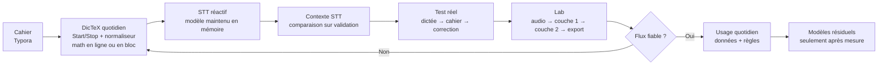

# Feuille de route de DicTeX

Statut : direction canonique adoptée le 10 juillet 2026.

Ce document est la source de vérité pour l'ordre des travaux. Les tickets
GitHub décrivent leur propre périmètre et leur état réel ; les anciens documents
de pivot expliquent l'historique, mais ne fixent plus la priorité courante.

## Point de départ

DicTeX n'est pas encore à l'étape de l'entraînement. Le contrat de sortie LaTeX
et les premières règles déterministes sont en place. La priorité est maintenant
de rendre la boucle quotidienne fiable, agréable et mesurable afin de produire
des données propres.

La cible à moyen terme reste :

```text
voix + micro
-> STT local personnalisé
-> texte littéral conservé
-> règles déterministes
-> petit modèle résiduel texte-vers-LaTeX
-> brouillon mêlant prose et mathématiques
-> correction rapide
-> apprentissage local à partir des corrections
```

DicTeX reste une couche de dictée. Il ne possède pas les documents et ne devient
pas un éditeur complet. Le premier cahier réel est **Typora**, avec des fichiers
Markdown locaux et du LaTeX. Zettlr est le repli si Typora introduit une friction
concrète. Obsidian ne redevient prioritaire que si les liens entre notes et les
fonctions de base de connaissances deviennent utiles.

## Ordre des travaux et portes de sortie

| Étape | Travail | Porte de sortie |
| --- | --- | --- |
| 0. Contrat de sortie — terminé | LaTeX canonique, mathématiques en ligne `$…$`, règles regex produisant ce format (#106, #107) | Une cible existante ne change plus de convention sans migration explicite |
| 1. Cahier réel | Configurer Typora et y faire une session mêlant prose, fractions, intégrales et équations | Une session de dix minutes reste lisible, corrigeable et enregistrée dans un fichier Markdown local |
| 2. Boucle quotidienne | Interrupteur du normaliseur — terminé (#105), Start/Stop cohérent entre bouton et raccourci (#96), mécanisme explicite pour un bloc `$$…$$`, jeu livré versionné + surcouche personnelle et migration non destructive des anciens `rules.json` (#150) | Vingt dictées consécutives sans désynchronisation, fuite de LaTeX ni perte d'audio, de texte brut, de règle personnelle ou d'événement |
| 3. STT maintenu en mémoire | Processus Python persistant, un seul modèle actif en mémoire vidéo, préchauffage asynchrone, état préparation/prêt, reprise après incident et mesures séparées du chargement et de la transcription | Le modèle n'est chargé qu'une fois par session d'application et les transcriptions suivantes ne paient plus son temps de chargement |
| 4. Contexte initial STT | Définir deux ou trois variantes courtes de `initial_prompt`, terminer leur comparaison dans le Lab (#94), choisir sur `validation`, puis appliquer le gagnant à la dictée quotidienne | Un gain reproductible est mesuré face à l'absence de contexte, ou le levier est abandonné explicitement |
| 5. Chemin complet de correction | Dicter dans Typora, corriger, retrouver le segment dans le Lab, écouter l'audio, saisir les couches 1 et 2, enregistrer dans `validation`, exporter et contrôler les fichiers | Un exemple complet est audité de bout en bout sans perte ni mélange entre erreur acoustique et transformation mathématique |
| 6. Usage quotidien | Faire cent dictées réelles, corriger dans le cahier puis qualifier les exemples utiles dans le Lab | Cent dictées sans perte de données et premières mesures stables de qualité, de latence et de coût de correction |
| 7. Règles d'abord | Améliorer le dictionnaire et les regex uniquement à partir d'erreurs observées ; construire le banc d'essai du normaliseur | Le résidu complexe que les règles ne peuvent pas couvrir est clairement mesuré |
| 8. Modèles plus tard | Petit seq2seq sur le résidu, puis adaptation STT seulement sur les erreurs réellement acoustiques | Chaque modèle bat sa référence sur `validation`, puis une seule lecture finale de `test_frozen` confirme le gain |

Les travaux #105 et #96 touchent la même vue de DicTeX : ils doivent être
intégrés séquentiellement pour éviter un conflit mou. Le maintien du modèle en
mémoire et #94 n'ont pas de dépendance technique stricte ; leur ordre ci-dessus
correspond au flux d'usage quotidien souhaité.

**Observation du 13 juillet 2026 pour l'étape 4.** Sur un snapshot de 27
segments de `validation`, les prompts à phrases exemplaires littérales ont
réduit le CER acoustique moyen face au lexique simple : 9,03 % pour
`conventions-litterales-v1`, 8,57 % pour `conventions-litterales-v2`, contre
12,01 % pour `prompt-lexique-v1`, sans différence de latence dans le run. V2 est
le gagnant provisoire, pas encore le choix quotidien : la baseline sans prompt
doit être relancée dans le même run, les conventions peu représentées doivent
être enrichies et la porte de sortie de #94 reste ouverte.

## Schéma dézoomé



## Mesures minimales

Les mesures restent séparées afin de savoir quelle couche s'améliore :

- CER acoustique sur le texte littéral corrigé ;
- exactitude LaTeX après canonicalisation ;
- taux de LaTeX rendu sans erreur ;
- corrections par minute et temps consacré aux corrections ;
- latence de préparation du moteur et latence de transcription chaude ;
- nombre de pertes d'audio, de texte brut, de normalisation ou de correction.

Objectif d'usage à terme pour dix minutes de mathématiques ou de physique :

- moins d'une erreur acoustique toutes les deux minutes ;
- plus de 95 % des expressions produisant un rendu LaTeX valide ;
- moins de 10 % du temps consacré aux corrections ;
- aucune perte de donnée ;
- démarrage assez rapide pour ne pas interrompre la pensée.

## Discipline d'évaluation

- `validation` sert à choisir les règles, les contextes initiaux et les modèles.
- `test_frozen` n'est consulté qu'une fois, après toutes les décisions.
- Le même audio sert à comparer l'absence de contexte et chaque variante de
  `initial_prompt`.
- Une expérimentation annonce sa référence, sa métrique, ses données et sa règle
  d'abandon avant de commencer.
- Aucun entraînement n'entre dans DicTeX avant d'avoir battu la référence dans
  le Lab.

## Mode opératoire du développement

Cette feuille de route fixe **quoi** construire. Le
[workflow agentique](agent-workflow.md) fixe **comment** les sessions Codex ou
Claude Code orchestrent, implémentent, revoient et corrigent chaque ticket. Une
PR conserve son code, ses tests et sa documentation affectée ; un Fixer reste
dans cette même PR, puis un reviewer neuf juge le nouveau SHA.

## Hors du chemin critique

Restent au parking : éditeur interne complet, analyseur mathématique, SQLite,
nuage, registre de modèles, synchronisation multiutilisateur, thème clair et
refonte typographique (#95). Le plan de premier entraînement STT (#45) doit être
réécrit plus tard, après #94, un volume acoustique minimal et une analyse du
résidu acoustique.
