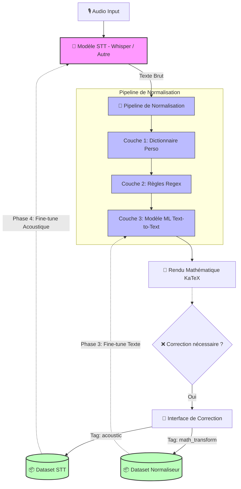

# 🔄 Pivot Stratégique : Découplage STT et Normalisation Mathématique

## Résumé (TL;DR)
Le projet change de priorité de développement. Jusqu'à présent, l'idée était de fine-tuner directement le modèle STT (Whisper ou autre) pour qu'il sorte du texte mathématique propre. Nous allons plutôt **découpler le pipeline en deux**.

1. **Priorité 1 :** Construire un pipeline de normalisation texte (Text-to-Text) pour transformer les sorties littérales en notation formelle. C'est la vraie valeur ajoutée.
2. **Priorité 2 :** Utiliser les données récoltées pour fine-tuner le modèle STT (peu importe qu'il s'agisse de Whisper ou d'un autre modèle évalué entre-temps) *uniquement* sur les erreurs purement acoustiques liées à ma voix/mon micro.

---

## Architecture Cible (Diagramme)



---

## Le problème tel qu'il est vraiment

*Observation :* Le modèle STT actuel fait des erreurs. Certaines sont indéniablement liées à ma voix, à mon débit, ou à mon micro. 
*Cependant*, quand je dicte "x au carré plus deux x", le modèle écrit souvent exactement ça. Ce n'est pas une erreur de reconnaissance, c'est la transcription fidèle de la parole.

**Fine-tuner un modèle acoustique pour qu'il comprenne que "au carré" doit devenir "²" est une erreur d'approche** : on mélangerait un problème d'acoustique et un problème de traduction sémantique. La nouvelle vision consiste à séparer ces deux problèmes pour les résoudre chacun avec le bon outil.

### Les 3 couches de normalisation (Priorité 1)

1. **Couche 1 (Dictionnaire) :** Remplacement de sous-chaînes en dur (ex: "dic tex" -> "DicTeX"). Zéro ML, résultat déterministe.
2. **Couche 2 (Règles Regex) :** Patterns de verbalisation mathématique (ex: `/\bx au carré\b/` -> "x²").
3. **Couche 3 (Modèle Normaliseur) :** Un petit modèle seq2seq (ex: T5-small) pour les cas que les règles ne catchent pas (ex: "la dérivée de f c'est e puissance x" -> "f'(x) = eˣ").

*Note : Une fois ce pipeline en place, si le modèle STT de base fait trop d'erreurs sur ma voix, nous lancerons un fine-tuning acoustique (ex: LoRA) pour le résoudre spécifiquement en Phase 4.*

---

## Ce qui CHANGE dans le codebase

### Redéfinition de la donnée collectée (PRIORITÉ MAXIMALE)
Pour pouvoir fine-tuner *deux* modèles différents (le normaliseur texte ET le STT acoustique), nous devons absolument **typer** la nature de nos corrections. Sans ce tag, les données sont inutilisables.

**Ajout imminent du type `CorrectionKind` :**

```typescript
type CorrectionKind = 
  | "acoustic"          // Le STT a mal entendu (ex: "égalé" -> "égal") -> SERVIRA POUR LA PHASE 4
  | "math_transform"    // Texte parlé -> Notation (ex: "x au carré" -> "x²") -> SERVIRA POUR LA PHASE 3
  | "normalization"     // Nettoyage (ex: "euh donc on a" -> "on a")
  | "rephrasing";       // Reformulation libre de l'utilisateur
```

Le système de split (`train_candidate_pool`, `test_frozen`) est gardé tel quel, mais servira de base de données pour deux objectifs distincts selon ce tag.

### Apparition d'un nouveau composant
Un nouveau module (Normaliseur) va faire son apparition pour chaîner les Couches 1, 2 et 3 et transformer le texte *avant* de l'envoyer à l'interface de rendu.

---

## Ce qui NE CHANGE PAS (Fondations solides)

L'infrastructure existante est exactement ce dont ce découplage a besoin. Rien n'est jeté :

- ✅ **Le moteur d'enregistrement audio** (Record/Stop/Transcribe).
- ✅ **L'interface de correction inline**. *Mise à jour mineure : ajout d'un sélecteur `CorrectionKind`.*
- ✅ **Le système de Benchmark**. Il sera étendu pour évaluer non seulement le CER du STT, mais aussi la précision du normaliseur.
- ✅ **Le système de Split** (`train`, `val`, `test`). C'est avec ça qu'on évaluera nos futurs modèles.
- ✅ **La gestion de l'historique et des segments audio** (crucial pour le futur fine-tuning acoustique).

---

## Pourquoi cet ordre est logique pour un outil "Single-User"

1. **Isolation des problèmes :** Si je fine-tune le STT maintenant, je vais mélanger des exemples acoustiques et des exemples mathématiques. En créant le normaliseur d'abord, j'isole les "vraies" erreurs du STT (les tags `acoustic`).
2. **Rapidité de résultat :** Un dictionnaire + des règles regex peuvent couvrir 60% de mes besoins mathématiques en 2 heures de code. Un fine-tuning STT demande des jours de préparation et de GPU.
3. **Indépendance au modèle STT :** Ce pipeline fonctionnera pareil si je décide de passer de Whisper à un autre modèle STT demain.

---

## Feuille de route mise à jour (Phasage)

- [ ] **Phase 1 : La donnée propre (Prochaine PR)**
  - Ajouter `correctionKind` à `SttCorrectionRequest` et à l'UI de correction.
  - *But : Arrêter de collecter de la donnée non labellisée.*
- [ ] **Phase 2 : Le Normaliseur "Code" (Couches 1 & 2)**
  - Implémenter le dictionnaire perso et le moteur de règles Regex.
  - *But : Voir immédiatement la qualité du rendu s'améliorer sans aucun Machine Learning.*
- [ ] **Phase 3 : Le Normaliseur ML (Couche 3)**
  - Après quelques semaines d'usage, extraire le dataset filtré sur `kind = "math_transform"`.
  - Fine-tuner un petit modèle texte (ex: T5-small).
- [ ] **Phase 4 : Le Fine-Tuning STT (Le retour du modèle vocal)**
  - Extraire le dataset filtré sur `kind = "acoustic"`.
  - Évaluer si les erreurs acoustiques restantes justifient l'investissement.
  - Si oui, appliquer un LoRA sur le modèle STT choisi **uniquement** sur ces données propres.
